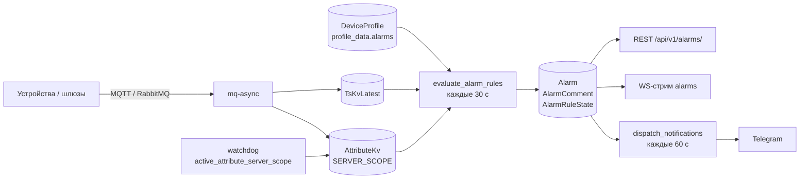
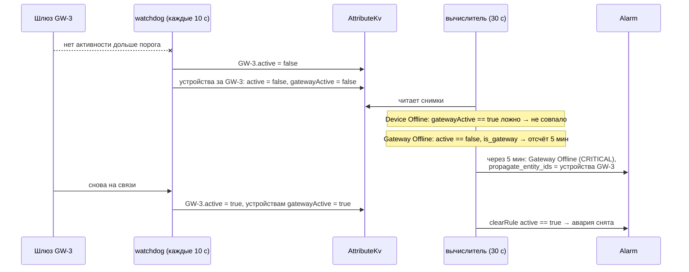

# Alarms — аварии, правила аварий и уведомления

Справочник по приложению `backend/apps/alarms`: как устроены аварии, как писать правила, как
работает вычислитель, API, WebSocket-стрим, Telegram-уведомления, эксплуатация и диагностика.

Модель правил портирована из ThingsBoard, поэтому структуры и имена полей совпадают с его
документацией; отличия собраны в [«Отличия от ThingsBoard»](#отличия-от-thingsboard).

> Ключи в рецептах, кроме `Room Temperature`, `active`, `notifyOnOffline` и `gatewayActive`, —
> условные (`Humidity`, `Water Leak` и т. п.). Реальные имена ключей конкретного тенанта отдаёт
> [`GET /api/v1/alarms/available-keys/`](#available-keys).

## Содержание

1. [Коротко](#1-коротко)
2. [Карта кода](#2-карта-кода)
3. [Модель данных](#3-модель-данных)
4. [Формат правил](#4-формат-правил)
5. [Как вычисляются правила](#5-как-вычисляются-правила)
6. [Правила связи: устройства и шлюзы](#6-правила-связи-устройства-и-шлюзы)
7. [Рецепты](#7-рецепты)
8. [REST API](#8-rest-api)
9. [WebSocket: стрим `alarms`](#9-websocket-стрим-alarms)
10. [Уведомления в Telegram](#10-уведомления-в-telegram)
11. [Настройка и эксплуатация](#11-настройка-и-эксплуатация)
12. [Диагностика](#12-диагностика)
13. [Тесты](#13-тесты)
14. [Расширение](#14-расширение)

---

## 1. Коротко

**Авария (`Alarm`)** — один инцидент на одном устройстве: «шлюз GW-3 не на связи с 10:15 до 10:42»,
«в номере 305 температура выше 30° с 14:00». Строка аварии **и есть журнал**: отдельной таблицы
событий нет, длительность инцидента — `clear_ts - start_ts`.

**Правило аварии** — JSON в формате ThingsBoard, лежит в `DeviceProfile.profile_data["alarms"]` и
действует на все активные устройства профиля. Своей таблицы у правил нет, редактируются они
обычным `PUT` профиля.

**Вычислитель** — Celery-задача, которая раз в `ALARMS_EVAL_INTERVAL_SEC` (30 с) читает последние
значения телеметрии (`TsKvLatest`) и серверных атрибутов (`AttributeKv`), прогоняет правила и
создаёт, обновляет или закрывает аварии.



### Словарь

| Термин | Где в коде | Смысл |
|---|---|---|
| Правило (`DeviceProfileAlarm`) | `profile_data["alarms"][i]` | Один тип аварии на профиле: набор правил создания по severity и правило снятия |
| `alarmType` | `Alarm.alarm_type` | Имя типа аварии: `Device Offline`, `High Temperature`. Уникально внутри профиля |
| Severity | `AlarmSeverity` | `CRITICAL` > `MAJOR` > `MINOR` > `WARNING` > `INDETERMINATE` |
| Originator | `Alarm.originator` | Устройство, на котором сработало правило |
| Условие (`condition`) | `AlarmCondition` | Список фильтров, объединённых через AND |
| Спецификация (`spec`) | `AlarmConditionSpec` | Сколько условие должно держаться: сразу, N времени или N проходов подряд |
| Расписание (`schedule`) | `AlarmSchedule` | Когда правило вообще действует |
| Распространение (`propagate`) | `Alarm.propagate_entity_ids` | На каких ещё сущностях видна авария |
| Квитирование (ack) | `Alarm.acknowledged` | «Оператор видел». На жизненный цикл не влияет |
| Снятие (clear) | `Alarm.cleared` | Инцидент закончился: автоматически по `clearRule` или вручную |

---

## 2. Карта кода

| Путь | Что там |
|---|---|
| `apps/alarms/models.py` | `Alarm`, `AlarmComment`, `AlarmRuleState` |
| `apps/alarms/constants.py` | Словарь TB: severity, типы ключей, операции, спецификации, расписания, белый список `ENTITY_FIELD` |
| `apps/alarms/serializers/rules/` | Валидация формата правил (зеркало классов TB) |
| `apps/alarms/serializers/alarm.py` | Сериализаторы аварий, комментариев, параметров фильтрации |
| `apps/alarms/services/engine.py` | Проход вычислителя: профили → устройства → снимки → правила |
| `apps/alarms/services/state.py` | Одно правило на одном устройстве: создать / обновить / эскалировать / снять; `ack`, `clear`, `assign` |
| `apps/alarms/services/snapshot.py` | `DataSnapshot` — значения устройства на момент прохода, приведение типов |
| `apps/alarms/services/predicates.py` | Вычисление предикатов и фильтров |
| `apps/alarms/services/dynamic.py` | `defaultValue` / `dynamicValue` с `inherit` |
| `apps/alarms/services/spec.py` | `SIMPLE` / `DURATION` / `REPEATING` |
| `apps/alarms/services/schedule.py` | `ANY_TIME` / `SPECIFIC_TIME` / `CUSTOM` |
| `apps/alarms/services/details.py` | Шаблон `alarmDetails` |
| `apps/alarms/services/propagate.py` | Цели распространения |
| `apps/alarms/services/preview.py` | Сухой прогон правил профиля |
| `apps/alarms/services/keys.py` | Каталог ключей для конструктора правил |
| `apps/alarms/services/attributes.py` | Запись серверных атрибутов `notifyOnOffline`, `gatewayActive` |
| `apps/alarms/notifications/` | Диспетчер уведомлений и настройки тенанта |
| `apps/alarms/channels/`, `apps/alarms/telegram/` | Канал доставки и HTTP-клиент Bot API |
| `apps/alarms/views/`, `urls.py`, `swagger/` | REST API |
| `apps/alarms/v2_consumers/alarms.py` | WS-стрим `alarms` |
| `apps/alarms/observables/alarm.py` | Пуш изменений в группу `alarms_<tenant_id>` |
| `apps/alarms/tasks.py` | `evaluate_alarm_rules`, `dispatch_notifications`, `purge_alarms` |
| `apps/main/serializers/notification_settings.py`, `views/notification_settings.py` | Настройки уведомлений тенанта |
| `apps/main/serializers/device.py` | Поле `notify_on_offline` устройства |
| `apps/main/serializers/device_profile.py` | Валидация `profile_data["alarms"]` при сохранении профиля |
| `apps/core/management/commands/active_attribute_server_scope.py` | Watchdog: поддерживает `gatewayActive` |

---

## 3. Модель данных

### 3.1. `Alarm` (`alarms_alarm`)

| Поле | Тип | Смысл |
|---|---|---|
| `id` | UUID | |
| `tenant` | FK `main.Tenant` | |
| `originator` | FK `main.Device` | Устройство, на котором сработало правило |
| `room` | FK `main.Room`, null | Номер устройства **на момент создания**. Денормализован: журнал переживает переезд устройства |
| `alarm_type` | str | `alarmType` правила |
| `severity` | str | Текущая severity. Может только расти (эскалация), но не падать |
| `acknowledged`, `ack_ts` | bool, datetime | Квитирование |
| `cleared`, `clear_ts` | bool, datetime | Снятие |
| `start_ts` | datetime | Когда авария создана (условие со спецификацией впервые выполнилось) |
| `end_ts` | datetime | Последний проход, на котором правило создания ещё срабатывало |
| `details` | JSON | `{"message": "…", "values": {…}}` — отрендеренный `alarmDetails` и значения ключей из условия |
| `propagate`, `propagate_relation_types`, `propagate_to_owner`, `propagate_to_tenant` | | Копия настроек распространения из правила |
| `propagate_entity_ids` | UUID[] (GIN) | Сущности, на которых авария тоже видна |
| `assignee`, `assign_ts` | FK `users.User`, datetime | Назначенный исполнитель |
| `notified_at`, `notified_clear_at` | datetime | Служебные отметки диспетчера уведомлений |
| `created_at`, `created_by`, `updated_at`, `updated_by` | | Из `BaseModel` / `UpdateByModel` (`created_at` — Unix-мс) |

Вычисляемые свойства: `status` и `duration_ms` (`(clear_ts или end_ts) - start_ts`).

Индексы: `(tenant, cleared, -start_ts)`, `(originator, -start_ts)`, `(alarm_type, -start_ts)`,
`(severity, -start_ts)`, GIN по `propagate_entity_ids`.

### 3.2. Статус

Статус не хранится — это пара двух независимых флагов:

| | `acknowledged = false` | `acknowledged = true` |
|---|---|---|
| **`cleared = false`** | `ACTIVE_UNACK` | `ACTIVE_ACK` |
| **`cleared = true`** | `CLEARED_UNACK` | `CLEARED_ACK` |

Квитирование не закрывает аварию, закрытие не квитирует. Закрытую аварию можно квитировать.

### 3.3. Дедупликация

На одном устройстве может быть **не больше одной незакрытой аварии каждого типа** — это частичный
уникальный индекс в БД:

```python
UniqueConstraint(fields=["originator", "alarm_type"], condition=Q(cleared=False),
                 name="uniq_active_alarm_per_originator_type")
```

Следствия:

- повторные срабатывания правила не плодят строки, а сдвигают `end_ts` существующей;
- после снятия следующий инцидент — это **новая** строка;
- гонка двух процессов, вставляющих одну и ту же аварию, решается на уровне БД:
  `get_or_create` вернёт уже существующую строку.

### 3.4. `AlarmComment` (`alarms_alarm_comment`)

| Поле | Смысл |
|---|---|
| `alarm` | FK `Alarm`, каскадное удаление |
| `user` | Автор (null для записей вычислителя) |
| `alarm_comment_type` | `OTHER` — комментарий человека, `SYSTEM` — аудит жизненного цикла |
| `comment` | JSON |

`SYSTEM`-комментарии пишутся автоматически и через API недоступны для правки. Их формы:

```json
{"subtype": "SEVERITY_CHANGED", "from": "MINOR", "to": "MAJOR", "text": "Severity changed from MINOR to MAJOR"}
{"subtype": "ACKNOWLEDGED", "text": "Alarm acknowledged"}
{"subtype": "CLEARED", "text": "Alarm cleared"}
{"subtype": "CLEARED", "text": "Cleared manually"}
{"subtype": "ASSIGNED", "assignee": "5b8f0c0e-7d8f-4a55-9d4e-0f2f6d1f7a10", "text": "Assigned to engineer@hotel.uz"}
{"subtype": "UNASSIGNED", "assignee": null, "text": "Unassigned"}
```

`CLEARED` с текстом `Alarm cleared` оставляет вычислитель (сработал `clearRule`, `user = null`),
`Cleared manually` — ручное закрытие через `POST …/clear/` (`user` — оператор). Массовое
закрытие (`bulk/clear/`) пишет `Alarm cleared` с `user` оператора.

Пользовательский комментарий: `{"text": "Выехал техник"}`, после правки —
`{"text": "…", "edited": true, "edited_at": "2026-09-14T10:31:02.114Z"}`.

### 3.5. `AlarmRuleState` (`alarms_rule_state`)

Счётчики спецификаций `DURATION` / `REPEATING` между проходами вычислителя. Одна строка на пару
(устройство, `alarmType`); создаётся при первом совпадении условия и удаляется, как только ни одно
правило этого типа ничего не отсчитывает.

```json
{
  "MAJOR": {"since": "2026-09-14T10:00:00.123456+00:00"},
  "MINOR": {"since": "2026-09-14T09:58:30.000000+00:00"},
  "CLEAR": {"count": 2}
}
```

Ключи — severity правил создания и `CLEAR` для правила снятия. Счётчики хранятся в БД, а не в
памяти процесса, поэтому переживают деплой и перезапуск воркеров. Строку можно смело удалить:
отсчёт просто начнётся заново.

---

## 4. Формат правил

Правила — массив в `DeviceProfile.profile_data["alarms"]`. Имена полей — camelCase, **как в
ThingsBoard**: правило, экспортированное из профиля TB, вставляется без правок (с поправкой на
[отличия GRMS](#отличия-от-thingsboard)). Хранится ровно то, что вернул валидатор, — с
дописанными значениями по умолчанию.

### 4.1. Полный скелет

```jsonc
{
  "id": "myHighTemperature",            // необязательно; произвольная строка
  "alarmType": "High Temperature",      // обязательно; уникально внутри профиля
  "createRules": {                      // обязательно; ключи — severity
    "MAJOR": {                          // AlarmRule
      "condition": {
        "condition": [                  // фильтры, AND; минимум один
          {
            "key": {"type": "TIME_SERIES", "key": "Room Temperature"},
            "valueType": "NUMERIC",
            "predicate": {
              "type": "NUMERIC",
              "operation": "GREATER",
              "value": {
                "defaultValue": 30,
                "dynamicValue": {"sourceType": "CURRENT_ROOM", "sourceAttribute": "temperatureMax", "inherit": true}
              }
            }
          }
        ],
        "spec": {"type": "DURATION", "unit": "MINUTES", "predicate": {"defaultValue": 5}}
      },
      "schedule": {"type": "ANY_TIME"},
      "alarmDetails": "Температура ${Room Temperature}° в номере ${room}",
      "dashboardId": null
    }
  },
  "clearRule": {                        // необязательно; без него авария закрывается только вручную
    "condition": {
      "condition": [
        {
          "key": {"type": "TIME_SERIES", "key": "Room Temperature"},
          "valueType": "NUMERIC",
          "predicate": {"type": "NUMERIC", "operation": "LESS", "value": {"defaultValue": 29}}
        }
      ],
      "spec": {"type": "SIMPLE"}
    }
  },
  "propagate": false,
  "propagateRelationTypes": [],
  "propagateToOwner": false,
  "propagateToTenant": false
}
```

(`jsonc` здесь только ради комментариев — в API отправляется обычный JSON.)

### 4.2. `DeviceProfileAlarm` — верхний уровень

| Поле | Обяз. | По умолчанию | Смысл |
|---|---|---|---|
| `id` | нет | — | Идентификатор правила, произвольная строка. Стоит задавать свой (`myDeviceOffline`): по нему правило находят скрипты и миграции |
| `alarmType` | да | — | Тип аварии, до 255 символов |
| `createRules` | да | — | Словарь `severity → AlarmRule`, непустой, ключи только из пяти severity |
| `clearRule` | нет | — | `AlarmRule` снятия (`alarmDetails` в нём не используется) |
| `propagate` | нет | `false` | Распространять на связанные устройства |
| `propagateRelationTypes` | нет | `[]` | Типы связей `shuttle.Relation`; пусто — любые |
| `propagateToOwner` | нет | `false` | Добавить id номера устройства в `propagate_entity_ids` |
| `propagateToTenant` | нет | `false` | Добавить id тенанта в `propagate_entity_ids` |

### 4.3. `AlarmRule`

| Поле | Обяз. | Смысл |
|---|---|---|
| `condition` | да | `{"condition": [фильтры], "spec": {…}}`; `spec` по умолчанию `{"type": "SIMPLE"}` |
| `schedule` | нет | Расписание; отсутствует или `null` — действует всегда |
| `alarmDetails` | нет | Шаблон сообщения, см. [4.9](#49-alarmdetails--шаблон-сообщения) |
| `dashboardId` | нет | Хранится ради совместимости с TB, не используется |

### 4.4. Фильтр условия

```json
{
  "key": {"type": "ATTRIBUTE", "key": "active"},
  "valueType": "BOOLEAN",
  "value": null,
  "predicate": {"type": "BOOLEAN", "operation": "EQUAL", "value": {"defaultValue": false}}
}
```

**Типы ключа (`key.type`):**

| Тип | Откуда берётся значение |
|---|---|
| `TIME_SERIES` | `TsKvLatest` устройства — последнее значение ключа телеметрии (имя из `TsKvDictionary`, с пробелами и регистром как есть) |
| `ATTRIBUTE` | `AttributeKv` устройства со скоупом **`SERVER_SCOPE`** |
| `ENTITY_FIELD` | Поле самого устройства или его номера, только из белого списка ниже |
| `CONSTANT` | Литерал из поля `value` фильтра; `key.key` не нужен |

**Белый список `ENTITY_FIELD`:**

| Поле | Тип значения | Подходящий `valueType` |
|---|---|---|
| `name` | строка | `STRING` |
| `type` | строка | `STRING` |
| `label` | строка или null | `STRING` |
| `status` | bool (`Device.status`) | `BOOLEAN` |
| `is_active` | bool | `BOOLEAN` — бесполезно: вычислитель берёт только активные устройства |
| `is_gateway` | bool, `Device.additional_info["gateway"]` | `BOOLEAN` |
| `room.number` | строка | `STRING` |
| `room.floor` | строка (!) | `STRING` — `"3"`, а не `3` |
| `room.state` | список чисел | не рекомендуется: сравнивается строковое представление `"[1, 3]"` |

У устройства без номера полей `room.*` нет — любой предикат по ним ложен.

**`valueType` и чтение значения:**

| `valueType` | Как читается значение из строки `TsKvLatest` / `AttributeKv` |
|---|---|
| `NUMERIC` | `dbl_v`, иначе `long_v`, иначе `str_v`, если строка парсится как число |
| `BOOLEAN` | `bool_v`, иначе `str_v` из `true/1/yes/on` или `false/0/no/off` (без учёта регистра). **`long_v` не читается** |
| `STRING` | `str_v`, иначе первое непустое значение, приведённое к строке |
| `DATE_TIME` | как `NUMERIC` — Unix-время в миллисекундах |

> **Ловушка:** если контроллер шлёт булево значение числом `0`/`1` (оно ляжет в `long_v`),
> `BOOLEAN`-фильтр его не увидит и никогда не совпадёт. Для таких ключей используйте
> `NUMERIC` + `EQUAL 1`.

**Совместимость `valueType` и типа предиката** проверяется валидатором, в том числе для всех
листьев `COMPLEX`:

| `valueType` | Тип предиката |
|---|---|
| `NUMERIC`, `DATE_TIME` | `NUMERIC` |
| `BOOLEAN` | `BOOLEAN` |
| `STRING` | `STRING` |

### 4.5. Предикаты

**`NUMERIC`** — `EQUAL`, `NOT_EQUAL`, `GREATER`, `LESS`, `GREATER_OR_EQUAL`, `LESS_OR_EQUAL`.
Обе стороны приводятся к `float`.

```json
{"type": "NUMERIC", "operation": "GREATER_OR_EQUAL", "value": {"defaultValue": 30}}
```

**`BOOLEAN`** — `EQUAL`, `NOT_EQUAL`.

```json
{"type": "BOOLEAN", "operation": "EQUAL", "value": {"defaultValue": true}}
```

**`STRING`** — `EQUAL`, `NOT_EQUAL`, `STARTS_WITH`, `ENDS_WITH`, `CONTAINS`, `NOT_CONTAINS`,
`IN`, `NOT_IN`; флаг `ignoreCase` (по умолчанию `false`). Для `IN`/`NOT_IN` значение — список
или строка через запятую (пробелы вокруг элементов обрезаются):

```json
{"type": "STRING", "operation": "IN", "ignoreCase": true, "value": {"defaultValue": ["error", "fault"]}}
{"type": "STRING", "operation": "NOT_IN", "value": {"defaultValue": "2.4.1, 2.4.2"}}
```

**`COMPLEX`** — `AND` / `OR` над вложенными предикатами, рекурсивно, до 5 уровней. Все
вложенные предикаты сравнивают **одно и то же** значение ключа фильтра. Условия на разные ключи
пишутся отдельными фильтрами (они объединяются через AND); OR между разными ключами в формате
TB не выражается — нужны два разных правила.

```json
{
  "type": "COMPLEX",
  "operation": "OR",
  "predicates": [
    {"type": "NUMERIC", "operation": "LESS", "value": {"defaultValue": 30}},
    {"type": "NUMERIC", "operation": "GREATER", "value": {"defaultValue": 70}}
  ]
}
```

**Отсутствующее значение никогда не совпадает.** Если у устройства нет ключа (не прислало
телеметрию, нет атрибута) или не удалось вычислить порог — предикат ложен, **включая
`NOT_EQUAL` и `NOT_IN`**. Устройство, ни разу не приславшее `Room Temperature`, не может
сработать ни по одному температурному правилу.

### 4.6. Значение предиката: `defaultValue` и `dynamicValue`

```json
{
  "defaultValue": 30,
  "dynamicValue": {"sourceType": "CURRENT_ROOM", "sourceAttribute": "temperatureMax", "inherit": true}
}
```

Нужно хотя бы одно из двух. Порядок разрешения:

1. Если есть `dynamicValue` — ищется атрибут `sourceAttribute` в источнике `sourceType`.
2. Не найден и `inherit: true` — поиск продолжается **вверх** по цепочке
   `CURRENT_DEVICE → CURRENT_ROOM → CURRENT_TENANT`, начиная со следующего за источником уровня.
3. Ничего не найдено — используется `defaultValue`.
4. Нет и `defaultValue` — предикат ложен.

**Где лежат атрибуты источников:**

| `sourceType` | Хранилище |
|---|---|
| `CURRENT_DEVICE` | `AttributeKv` устройства, `SERVER_SCOPE` |
| `CURRENT_ROOM` | `Room.additional_info["attributes"]` |
| `CURRENT_TENANT` | `Tenant.additional_info["attributes"]` |

`CURRENT_USER` и `CURRENT_CUSTOMER` из TB не поддерживаются — валидатор их отклонит.

**Пример разрешения** для `{"defaultValue": 30, "dynamicValue": {"sourceType": "CURRENT_ROOM", "sourceAttribute": "temperatureMax", "inherit": …}}`:

| Номер | Тенант | `inherit: false` | `inherit: true` |
|---|---|---|---|
| `26` | `28` | 26 | 26 |
| — | `28` | 30 | 28 |
| — | — | 30 | 30 |

Атрибут устройства в этой цепочке не участвует никогда: поиск идёт только вверх от источника.
Чтобы устройство могло переопределить порог номера, источником должен быть `CURRENT_DEVICE`
с `inherit: true`.

Значения атрибутов номера и тенанта — обычный JSON; строка `"26"` тоже будет приведена к числу.

### 4.7. Спецификация условия

| Тип | Срабатывает | Поля |
|---|---|---|
| `SIMPLE` | на первом проходе, где условие выполнено | — |
| `DURATION` | когда условие выполняется непрерывно не меньше заданного времени | `unit`: `SECONDS` / `MINUTES` / `HOURS` / `DAYS`; `predicate`: значение (положительное) |
| `REPEATING` | на N-м подряд проходе, где условие выполнено | `predicate`: целое ≥ 1 |

```json
{"type": "DURATION", "unit": "MINUTES", "predicate": {"defaultValue": 10}}
{"type": "REPEATING", "predicate": {"defaultValue": 3}}
```

`predicate` спецификации — такое же значение предиката, как в 4.6, поэтому длительность и число
повторов можно брать из атрибута (`dynamicValue`).

**Непрерывность.** Один проход, где условие не выполнено, сбрасывает и часы `DURATION`, и
счётчик `REPEATING`.

**`DURATION` на шкале времени** (интервал вычислителя 30 с, правило «`active == false` 10 минут»):

| Время | `active` | Что происходит |
|---|---|---|
| 10:00:00 | `false` | Первое совпадение: `AlarmRuleState = {"MAJOR": {"since": "10:00:00"}}`, аварии нет |
| 10:05:00 | `false` | Прошло 5 мин < 10 — ждём |
| 10:07:30 | `true` | Условие не выполнено — состояние удалено |
| 10:08:00 | `false` | Отсчёт заново с 10:08:00 |
| 10:18:00 | `false` | Прошло 10 мин — **авария создана**, `start_ts = 10:18:00` |
| 10:18:30 | `false` | Авария есть — сдвигается `end_ts` |

**Отличие от TB: `REPEATING` считает проходы вычислителя, а не входящие сообщения.** Вычислитель
читает последнее значение из `TsKvLatest`; если устройство молчит, то же самое значение будет
засчитано на каждом проходе. `REPEATING 3` при интервале 30 с — это «условие видно на трёх
проходах подряд», то есть примерно минута. По смыслу это короткий `DURATION`, защищающий от
одиночных выбросов между проходами.

### 4.8. Расписание

Вне расписания правило **не существует**: не срабатывает и теряет накопленный отсчёт
`DURATION`/`REPEATING`. Расписание задаётся отдельно для каждого правила создания и для правила
снятия.

**`ANY_TIME`** — всегда (то же, что отсутствие `schedule`).

**`SPECIFIC_TIME`** — одно окно для выбранных дней недели:

```json
{
  "type": "SPECIFIC_TIME",
  "timezone": "Asia/Tashkent",
  "daysOfWeek": [1, 2, 3, 4, 5],
  "startsOn": 32400000,
  "endsOn": 64800000
}
```

**`CUSTOM`** — своё окно для каждого дня:

```json
{
  "type": "CUSTOM",
  "timezone": "Asia/Tashkent",
  "items": [
    {"enabled": true,  "dayOfWeek": 1, "startsOn": 28800000, "endsOn": 72000000},
    {"enabled": true,  "dayOfWeek": 6, "startsOn": 36000000, "endsOn": 57600000},
    {"enabled": false, "dayOfWeek": 7, "startsOn": 0, "endsOn": 0}
  ]
}
```

Правила интерпретации:

- `daysOfWeek` / `dayOfWeek` — ISO: понедельник `1`, воскресенье `7`;
- `startsOn` / `endsOn` — миллисекунды от полуночи **в `timezone`** расписания (IANA-имя, по
  умолчанию `UTC`; неизвестная зона отклоняется валидатором);
- окно полуоткрытое: `startsOn ≤ t < endsOn`;
- `startsOn == endsOn` — весь день;
- `startsOn > endsOn` — окно через полночь (`22:00 → 06:00`): активно `t ≥ startsOn` **или**
  `t < endsOn`. День недели проверяется по **текущему** локальному дню, поэтому для
  `daysOfWeek: [1]` активны пн 00:00–06:00 и пн 22:00–24:00, а вт 00:00–06:00 — только если в
  списке есть и `2`. Для ночей «пн→вт … пт→сб» перечисляйте дни `1–6`;
- в `CUSTOM` день без элемента в `items` или с `enabled: false` — правило неактивно весь день.

Шпаргалка по времени:

| Время | мс | Время | мс |
|---|---|---|---|
| 00:00 | `0` | 13:00 | `46800000` |
| 06:00 | `21600000` | 18:00 | `64800000` |
| 07:00 | `25200000` | 20:00 | `72000000` |
| 08:00 | `28800000` | 22:00 | `79200000` |
| 09:00 | `32400000` | 23:00 | `82800000` |
| 10:00 | `36000000` | 24:00 | `86400000` |

Формула: `(часы × 60 + минуты) × 60 000`.

### 4.9. `alarmDetails` — шаблон сообщения

Строка с подстановками `${…}`. Результат попадает в `Alarm.details["message"]`, в карточку аварии
и в Telegram. Шаблон перерисовывается на **каждом** проходе, где правило создания срабатывает, —
сообщение показывает свежее значение.

| Подстановка | Значение |
|---|---|
| `${originatorName}` | Имя устройства |
| `${room}` | Номер комнаты устройства или пустая строка |
| `${alarmType}` | `alarmType` правила |
| `${alarmSeverity}` | Severity сработавшего правила |
| `${<ключ телеметрии>}` | Последнее значение, например `${Room Temperature}` — пробелы в имени допустимы |
| `${<ключ атрибута>}` | Значение серверного атрибута |
| `${<ENTITY_FIELD>}` | `${name}`, `${room.floor}`, `${is_gateway}` … |

Порядок поиска для произвольного имени: телеметрия → атрибут → поле устройства.

- Нераспознанная подстановка остаётся текстом как есть (`${Humidity}`), задача не падает.
- Гарантированно доступны только ключи, которые **используются в условиях правил** этого
  профиля: вычислитель не загружает ключи, на которые никто не ссылается.
- Пустой или отсутствующий шаблон даёт `"<alarmType> — <имя устройства>"`.

Пример: `"Температура ${Room Temperature}° в номере ${room}, этаж ${room.floor} (${alarmSeverity})"`
→ `"Температура 31.5° в номере 305, этаж 3 (MAJOR)"`.

`details["values"]` — снимок значений ключей из фильтров сработавшего правила (кроме
`CONSTANT`), например `{"Room Temperature": 31.5}`.

### 4.10. Распространение

По умолчанию авария видна только на устройстве-источнике. С распространением идентификаторы
целевых сущностей записываются в `Alarm.propagate_entity_ids` **один раз при создании**:

| Поле правила | Что добавляется |
|---|---|
| `propagate: true` | Устройства на **любом** конце связи `shuttle.Relation` с источником (и `from`, и `to`); `propagateRelationTypes` сужает по `relation_type` |
| `propagateToOwner: true` | id номера устройства |
| `propagateToTenant: true` | id тенанта |

Фильтр `device=<id>` в API и WS возвращает аварии, где устройство — источник **или** есть в
`propagate_entity_ids`. Так авария шлюза видна в карточке каждого устройства за ним.

Связи, появившиеся после создания аварии, на неё не влияют (как в TB).

### 4.11. Валидация

Правила проверяются при каждом сохранении профиля (`PUT /api/v1/main/device-profile/<pk>/`, если
в `profile_data` есть ключ `alarms`) и в [`preview`](#preview). Проверяется:

- `alarmType` уникален внутри профиля;
- `createRules` непустой, ключи — только `CRITICAL`/`MAJOR`/`MINOR`/`WARNING`/`INDETERMINATE`;
- в каждом условии минимум один фильтр;
- `CONSTANT` требует `value`, остальные типы ключа — непустой `key.key`;
- `ENTITY_FIELD` — только из белого списка;
- `valueType` совместим с типом предиката, включая все листья `COMPLEX`;
- операция допустима для типа предиката; `COMPLEX` — непустой `predicates`, глубина ≤ 5;
- у значения предиката есть `defaultValue` или `dynamicValue`;
- `dynamicValue.sourceType` — `CURRENT_DEVICE` / `CURRENT_ROOM` / `CURRENT_TENANT`;
- `DURATION` — известный `unit` и положительное `defaultValue`; `REPEATING` — целое ≥ 1;
- расписание: дни 1–7, время 0…86 400 000, известная `timezone`, `CUSTOM` — непустой `items`.

Валидатор дописывает значения по умолчанию: `spec: {"type": "SIMPLE"}`, `ignoreCase: false`,
`inherit: false`, `timezone: "UTC"`, `propagate*`.

Пример ответа `400` (в `valueType` указан `NUMERIC` для булева предиката, длительность `0`):

```json
{
  "profile_data": {
    "alarms": [
      {
        "createRules": {
          "MAJOR": {
            "condition": {
              "condition": [
                {"predicate": ["valueType NUMERIC needs NUMERIC predicates, got ['BOOLEAN']."]}
              ],
              "spec": {"predicate": ["A DURATION needs a positive 'defaultValue'."]}
            }
          }
        }
      }
    ]
  }
}
```

Путь к ошибке повторяет путь в JSON правила; элементы массивов — по индексу. В `preview`
обёртки `profile_data` нет — ответ начинается с `alarms`. Пустой `createRules`:
`{"alarms": [{"createRules": ["This dictionary may not be empty."]}]}`.

### Отличия от ThingsBoard

| ThingsBoard | GRMS |
|---|---|
| Правила вычисляются на каждом входящем сообщении в rule chain | Периодически, раз в `ALARMS_EVAL_INTERVAL_SEC`, по последним значениям |
| `REPEATING` считает сообщения | Считает проходы вычислителя |
| Атрибуты есть у любой сущности | `AttributeKv` — только у устройств; у номера и тенанта — `additional_info["attributes"]` |
| `CURRENT_USER`, `CURRENT_CUSTOMER` | Не поддерживаются; добавлен `CURRENT_ROOM` |
| `ENTITY_FIELD` — любое поле | Белый список, включая `is_gateway` и `room.*` |
| Связь «авария ↔ сущность» в таблице `relation` | Массив `Alarm.propagate_entity_ids` |
| Notification Center | Упрощённый диспетчер с каналом Telegram |

В коде такие места помечены комментарием `GRMS deviation:`.

---

## 5. Как вычисляются правила

### 5.1. Проход

Задача `alarms.tasks.evaluate_alarm_rules` (очередь `default`, beat каждые
`ALARMS_EVAL_INTERVAL_SEC`, по умолчанию 30 с). При `ALARMS_ENABLED=false` сразу выходит.

1. Берутся активные профили (`DeviceProfile.active = true`) с непустым `profile_data["alarms"]`.
2. Берутся их активные устройства (`Device.is_active = true`), пачками по 500.
3. Для пачки собираются все ключи, на которые ссылаются правила: имена `TIME_SERIES`, имена
   `ATTRIBUTE`, атрибуты устройства из `dynamicValue` с `CURRENT_DEVICE`.
4. По одному запросу читаются `TsKvLatest` и `AttributeKv` (`SERVER_SCOPE`) по этим ключам, плюс
   `additional_info["attributes"]` номеров и тенантов. Из этого строится `DataSnapshot` на
   каждое устройство.
5. Каждое правило профиля прогоняется на снимке каждого устройства (5.2).
6. Изменения счётчиков пишутся пачкой в `AlarmRuleState`.
7. Если что-то создано, эскалировано или снято — в WS-группы затронутых тенантов уходит
   `alarm.update` (после коммита транзакции).

Ошибка в одном правиле логируется (`Alarm rule '<type>' failed on device <id>`) и не
останавливает проход по остальным правилам и устройствам.

### 5.2. Одно правило на одном устройстве

Порт `AlarmState.process` из TB (`services/state.py`):

```text
для severity в порядке CRITICAL, MAJOR, MINOR, WARNING, INDETERMINATE:
    нет правила этой severity            → дальше
    правило вне своего расписания        → дальше (его отсчёт забывается)
    совпало = все фильтры условия истинны
    сработало, отсчёт = spec(совпало, прежний отсчёт)
    если сработало:
        нет активной аварии этого типа   → СОЗДАТЬ (severity, start_ts = end_ts = now, details)
        есть активная                    → end_ts = now, details обновить;
                                           если эта severity выше текущей → ЭСКАЛИРОВАТЬ + SYSTEM-комментарий
        КОНЕЦ (нижние severity и clearRule на этом проходе не смотрятся)

ни одно правило создания не сработало:
    есть активная авария и clearRule, clearRule в расписании:
        совпало = фильтры clearRule; сработало = spec(…)
        если сработало                   → СНЯТЬ (cleared, clear_ts = now, SYSTEM-комментарий)
```

### 5.3. Следствия, которые важно помнить

- **Побеждает первое *сработавшее* правило, а не первое совпавшее.** Пока `CRITICAL` с
  `DURATION` отсчитывает время, `MAJOR` с `SIMPLE` уже может создать аварию; когда `CRITICAL`
  досчитает — случится эскалация. На этом строятся многоуровневые правила (рецепт 7.2).
- **Сработавшее правило сбрасывает отсчёты нижних severity.** Правила ниже сработавшего на этом
  проходе не вычисляются, и их `since`/`count` не сохраняются. Если температура упала из зоны
  `CRITICAL` в зону `MAJOR` с `DURATION`, отсчёт `MAJOR` начнётся с нуля.
- **Severity только растёт.** Если позже срабатывает правило ниже текущей severity, у аварии
  обновляется `end_ts`, но severity не понижается.
- **`clearRule` проверяется, только если на этом проходе не сработало ни одно правило создания.**
  Если условия создания и снятия пересекаются, авария не закроется никогда. Между порогами
  должен быть зазор: создание `> 30`, снятие `< 29`.
- **Зона между порогами «замораживает» аварию.** При температуре 29.5 правило создания `> 30` не
  срабатывает, снятие `< 29` тоже: авария остаётся активной, `end_ts` не двигается.
- **Без `clearRule` авария живёт до ручного закрытия.**
- **Ручное закрытие или удаление при всё ещё выполненном условии** приводит к созданию новой
  аварии на следующем проходе. Это верно и для `DURATION`: пока авария была активна, отсчёт
  сохранялся, и длительность уже набрана.
- **Отсутствующее значение не совпадает ни с чем** (4.5). Нет ключа — нет аварии, и нет снятия.
- **Возраст значения не учитывается.** Вычислитель видит последнее значение в `TsKvLatest`,
  даже если устройство молчит сутки. Если это важно, добавьте в условие фильтр
  `ATTRIBUTE active == true` (рецепт 7.1).
- **`end_ts` сдвигается без пуша в WS.** Клиенту приходит обновление только при создании,
  эскалации и снятии (и при действиях через API).
- **Задержка.** Авария появляется не раньше чем через `длительность spec` после первого прохода,
  увидевшего условие, и не позже чем ещё через один интервал вычислителя.

### 5.4. Производительность

На проход — два запроса к `TsKvLatest`/`AttributeKv` на каждые 500 устройств плюс запросы
активных аварий и `AlarmRuleState` для той же пачки. Для выборки по ключам добавлен индекс
(`shuttle/0028_alter_tskvlatest_entity_and_more`). Вычисление в Python — микросекунды на сравнение. Интервал регулируется
`ALARMS_EVAL_INTERVAL_SEC`.

В логе celery-default после каждого прохода:

```text
Alarm evaluation: 1480 devices × 12 rules → 2 created, 0 escalated, 1 cleared
```

`rules` — сумма правил по всем профилям с правилами (три профиля по четыре правила — `12`), а не
число пар «устройство × правило».

---

## 6. Правила связи: устройства и шлюзы

**Готовых правил в системе нет.** Профили нового тенанта создаются пустыми, и каждый тенант
заводит свои правила сам — через [`PUT` профиля](#82-правила). Ниже — пара правил связи целиком:
она закрывает журнал отключений устройств и шлюзов и снимает каскад шлюза. Температурные пороги —
в [рецепте 7.1](#71-порог-температуры-на-номер-и-тенант-только-для-устройств-на-связи).

| `alarmType` | Severity | Создание | Снятие |
|---|---|---|---|
| `Device Offline` | `MAJOR` | `active == false` И `notifyOnOffline == true` И `gatewayActive == true` И `is_gateway == false`, `DURATION` 10 мин | `active == true` |
| `Gateway Offline` | `CRITICAL` | `active == false` И `is_gateway == true`, `DURATION` 5 мин, `propagate: true` | `active == true` |

Оба правила живут на одном профиле: фильтр `is_gateway` разводит их по устройствам, поэтому
отдельный профиль для шлюзов не нужен.

```json
[
  {
    "id": "myDeviceOffline",
    "alarmType": "Device Offline",
    "createRules": {
      "MAJOR": {
        "condition": {
          "condition": [
            {"key": {"type": "ATTRIBUTE", "key": "active"}, "valueType": "BOOLEAN",
             "predicate": {"type": "BOOLEAN", "operation": "EQUAL", "value": {"defaultValue": false}}},
            {"key": {"type": "ATTRIBUTE", "key": "notifyOnOffline"}, "valueType": "BOOLEAN",
             "predicate": {"type": "BOOLEAN", "operation": "EQUAL", "value": {"defaultValue": true}}},
            {"key": {"type": "ATTRIBUTE", "key": "gatewayActive"}, "valueType": "BOOLEAN",
             "predicate": {"type": "BOOLEAN", "operation": "EQUAL", "value": {"defaultValue": true}}},
            {"key": {"type": "ENTITY_FIELD", "key": "is_gateway"}, "valueType": "BOOLEAN",
             "predicate": {"type": "BOOLEAN", "operation": "EQUAL", "value": {"defaultValue": false}}}
          ],
          "spec": {"type": "DURATION", "unit": "MINUTES", "predicate": {"defaultValue": 10}}
        },
        "schedule": {"type": "ANY_TIME"},
        "alarmDetails": "Устройство ${originatorName} не на связи"
      }
    },
    "clearRule": {
      "condition": {
        "condition": [
          {"key": {"type": "ATTRIBUTE", "key": "active"}, "valueType": "BOOLEAN",
           "predicate": {"type": "BOOLEAN", "operation": "EQUAL", "value": {"defaultValue": true}}}
        ],
        "spec": {"type": "SIMPLE"}
      }
    }
  },
  {
    "id": "myGatewayOffline",
    "alarmType": "Gateway Offline",
    "createRules": {
      "CRITICAL": {
        "condition": {
          "condition": [
            {"key": {"type": "ATTRIBUTE", "key": "active"}, "valueType": "BOOLEAN",
             "predicate": {"type": "BOOLEAN", "operation": "EQUAL", "value": {"defaultValue": false}}},
            {"key": {"type": "ENTITY_FIELD", "key": "is_gateway"}, "valueType": "BOOLEAN",
             "predicate": {"type": "BOOLEAN", "operation": "EQUAL", "value": {"defaultValue": true}}}
          ],
          "spec": {"type": "DURATION", "unit": "MINUTES", "predicate": {"defaultValue": 5}}
        },
        "schedule": {"type": "ANY_TIME"},
        "alarmDetails": "Шлюз ${originatorName} не на связи"
      }
    },
    "clearRule": {
      "condition": {
        "condition": [
          {"key": {"type": "ATTRIBUTE", "key": "active"}, "valueType": "BOOLEAN",
           "predicate": {"type": "BOOLEAN", "operation": "EQUAL", "value": {"defaultValue": true}}}
        ],
        "spec": {"type": "SIMPLE"}
      }
    },
    "propagate": true
  }
]
```

Ту же пару собирают хелперы `guarded_offline_rule()` и `gateway_offline_rule()` в
`apps/alarms/tests/base.py`, а `test_propagate.py::GatewayCascadeTest` прогоняет на них каскад —
так что пример выше проверен тестами, а не только написан.

### 6.1. Атрибуты, от которых зависят offline-правила

| Атрибут (`SERVER_SCOPE`) | Кто пишет | Зачем |
|---|---|---|
| `active` | Существующие механизмы связи: обработчик MQ и watchdog `active_attribute_server_scope` | Сам факт связи |
| `notifyOnOffline` | Тумблер устройства (`notify_on_offline` в API); при создании устройства — `true` | Отключить аварии связи для конкретного устройства |
| `gatewayActive` | Watchdog — при каждом тике для устройств за живыми (`true`) и упавшими (`false`) шлюзами; при создании устройства — `true` | Не плодить аварии устройств, когда упал их шлюз |

Если у устройства нет строки `notifyOnOffline` или `gatewayActive`, фильтр ложен и `Device
Offline` на нём **не сработает никогда** (4.5). Атрибуты пишутся только при создании устройства
через API, поэтому на парке, который был заведён раньше, правило молчит, пока атрибуты не
появятся. Watchdog сам проставит `gatewayActive` устройствам за шлюзами, которые он видит, —
остальным (и `notifyOnOffline` всем) нужен разовый прогон:

```python
from alarms.constants import ATTR_GATEWAY_ACTIVE, ATTR_NOTIFY_ON_OFFLINE
from alarms.services.attributes import set_server_attribute
from main.models import Device

for device_id in Device.objects.filter(tenant_id="<tenant_id>", is_active=True).values_list("id", flat=True):
    set_server_attribute(device_id, ATTR_NOTIFY_ON_OFFLINE, True)
    set_server_attribute(device_id, ATTR_GATEWAY_ACTIVE, True)
```

Устройствам за шлюзом, который сейчас не на связи, `gatewayActive` поправит watchdog на
следующем тике.

### 6.2. Каскад шлюза



Итог: одна авария `CRITICAL` на шлюзе, видимая в карточке каждого его устройства, вместо сотни
аварий `MAJOR`. Устройство, упавшее само по себе при живом шлюзе, по-прежнему получает свою
`Device Offline`.

Связи «шлюз → устройство» берутся из `shuttle.Relation` (`from_id` — шлюз, `to_id` — устройство).

---

## 7. Рецепты

Каждый рецепт — элемент массива `profile_data["alarms"]`. Как отправить массив в профиль —
в [8.2](#82-правила). Перед сохранением прогоняйте правила через [`preview`](#preview).

### 7.1. Порог температуры на номер и тенант, только для устройств на связи

```json
{
  "alarmType": "High Temperature",
  "createRules": {
    "MINOR": {
      "condition": {
        "condition": [
          {
            "key": {"type": "TIME_SERIES", "key": "Room Temperature"},
            "valueType": "NUMERIC",
            "predicate": {
              "type": "NUMERIC",
              "operation": "GREATER",
              "value": {
                "defaultValue": 30,
                "dynamicValue": {"sourceType": "CURRENT_ROOM", "sourceAttribute": "temperatureMax", "inherit": true}
              }
            }
          },
          {
            "key": {"type": "ATTRIBUTE", "key": "active"},
            "valueType": "BOOLEAN",
            "predicate": {"type": "BOOLEAN", "operation": "EQUAL", "value": {"defaultValue": true}}
          }
        ],
        "spec": {"type": "DURATION", "unit": "MINUTES", "predicate": {"defaultValue": 5}}
      },
      "alarmDetails": "Температура ${Room Temperature}° в номере ${room} (порог превышен)"
    }
  },
  "clearRule": {
    "condition": {
      "condition": [
        {
          "key": {"type": "TIME_SERIES", "key": "Room Temperature"},
          "valueType": "NUMERIC",
          "predicate": {
            "type": "NUMERIC",
            "operation": "LESS",
            "value": {
              "defaultValue": 29,
              "dynamicValue": {"sourceType": "CURRENT_ROOM", "sourceAttribute": "temperatureMaxClear", "inherit": true}
            }
          }
        }
      ]
    }
  }
}
```

Фильтр `active == true` отсекает устаревшее значение от устройства, которое уже не на связи.

**Порог на номер.** API: `PUT /api/v1/main/room/<pk>/` полным телом номера — `additional_info`
заменяется целиком, остальные его ключи надо передать как есть. Из shell:

```python
from main.models import Room

room = Room.objects.get(tenant_id="<tenant_id>", number="305", active=True)
info = room.additional_info or {}
info.setdefault("attributes", {}).update({"temperatureMax": 26, "temperatureMaxClear": 25})
room.additional_info = info
room.save(update_fields=["additional_info"])
```

**Порог на тенант** (API для атрибутов тенанта нет, только shell):

```python
from main.models import Tenant

tenant = Tenant.objects.get(id="<tenant_id>")
info = tenant.additional_info or {}
info.setdefault("attributes", {}).update({"temperatureMax": 28, "temperatureMaxClear": 27})
tenant.additional_info = info
tenant.save(update_fields=["additional_info"])
```

Итог: в номере 305 порог 26/25, в остальных номерах тенанта — 28/27; если атрибута нет ни у
номера, ни у тенанта — 30/29 из `defaultValue`.

> Масштаб значений: часть контроллеров шлёт температуру целым числом (`235` вместо `23.5`).
> Множителя в формате правил нет — порог задаётся в тех же единицах, что и телеметрия. Проверьте
> колонку значения, как в [7.11](#711-булево-значение-пришедшее-числом).
Изменение подхватывается на следующем проходе вычислителя.

### 7.2. Многоуровневая эскалация

```json
{
  "alarmType": "Overheat",
  "createRules": {
    "CRITICAL": {
      "condition": {
        "condition": [
          {"key": {"type": "TIME_SERIES", "key": "Room Temperature"}, "valueType": "NUMERIC",
           "predicate": {"type": "NUMERIC", "operation": "GREATER", "value": {"defaultValue": 35}}}
        ],
        "spec": {"type": "SIMPLE"}
      },
      "alarmDetails": "КРИТИЧНО: ${Room Temperature}° в номере ${room}"
    },
    "MAJOR": {
      "condition": {
        "condition": [
          {"key": {"type": "TIME_SERIES", "key": "Room Temperature"}, "valueType": "NUMERIC",
           "predicate": {"type": "NUMERIC", "operation": "GREATER", "value": {"defaultValue": 30}}}
        ],
        "spec": {"type": "DURATION", "unit": "MINUTES", "predicate": {"defaultValue": 15}}
      },
      "alarmDetails": "Жарко 15+ минут: ${Room Temperature}° в номере ${room}"
    },
    "MINOR": {
      "condition": {
        "condition": [
          {"key": {"type": "TIME_SERIES", "key": "Room Temperature"}, "valueType": "NUMERIC",
           "predicate": {"type": "NUMERIC", "operation": "GREATER", "value": {"defaultValue": 28}}}
        ],
        "spec": {"type": "DURATION", "unit": "MINUTES", "predicate": {"defaultValue": 5}}
      },
      "alarmDetails": "Тепло: ${Room Temperature}° в номере ${room}"
    }
  },
  "clearRule": {
    "condition": {
      "condition": [
        {"key": {"type": "TIME_SERIES", "key": "Room Temperature"}, "valueType": "NUMERIC",
         "predicate": {"type": "NUMERIC", "operation": "LESS", "value": {"defaultValue": 27}}}
      ]
    }
  }
}
```

| Время | Температура | Результат |
|---|---|---|
| 10:00 | 31 | `MAJOR` и `MINOR` начинают отсчёт; аварии нет |
| 10:05 | 31 | `MINOR` досчитал — **создана** `Overheat MINOR` |
| 10:15 | 31 | `MAJOR` досчитал — **эскалация** `MINOR → MAJOR`, `SYSTEM`-комментарий |
| 10:16 | 36 | `CRITICAL` (`SIMPLE`) — **эскалация** `MAJOR → CRITICAL` |
| 10:20 | 29 | `MINOR` начинает отсчёт **заново**: в 10:16 сработал `CRITICAL`, и отсчёты нижних severity сбросились. `end_ts` стоит, severity остаётся `CRITICAL` |
| 10:25 | 29 | `MINOR` досчитал — `end_ts` сдвигается, severity по-прежнему `CRITICAL` |
| 10:30 | 27.5 | Ни создание, ни снятие не выполнены — авария активна, `end_ts` стоит |
| 10:31 | 26 | `clearRule` — **снята** |

Порядок severity в JSON значения не имеет: они всегда перебираются от `CRITICAL` к `INDETERMINATE`.

### 7.3. Защита от выбросов датчика: `REPEATING` и отложенное снятие

```json
{
  "alarmType": "Temperature Sensor Suspicious",
  "createRules": {
    "WARNING": {
      "condition": {
        "condition": [
          {"key": {"type": "TIME_SERIES", "key": "Room Temperature"}, "valueType": "NUMERIC",
           "predicate": {
             "type": "COMPLEX", "operation": "OR",
             "predicates": [
               {"type": "NUMERIC", "operation": "LESS", "value": {"defaultValue": -10}},
               {"type": "NUMERIC", "operation": "GREATER", "value": {"defaultValue": 60}}
             ]
           }}
        ],
        "spec": {"type": "REPEATING", "predicate": {"defaultValue": 3}}
      },
      "alarmDetails": "Датчик в номере ${room} показывает ${Room Temperature}°"
    }
  },
  "clearRule": {
    "condition": {
      "condition": [
        {"key": {"type": "TIME_SERIES", "key": "Room Temperature"}, "valueType": "NUMERIC",
         "predicate": {
           "type": "COMPLEX", "operation": "AND",
           "predicates": [
             {"type": "NUMERIC", "operation": "GREATER_OR_EQUAL", "value": {"defaultValue": 0}},
             {"type": "NUMERIC", "operation": "LESS_OR_EQUAL", "value": {"defaultValue": 50}}
           ]
         }}
      ],
      "spec": {"type": "DURATION", "unit": "MINUTES", "predicate": {"defaultValue": 2}}
    }
  }
}
```

Авария появится, если значение вне диапазона на трёх проходах подряд (около минуты при
интервале 30 с), и снимется, только когда значение продержится в норме две минуты. `spec` у
`clearRule` работает так же, как у правил создания, — отсчёт хранится под ключом `CLEAR`.

### 7.4. Длительность из атрибута

Задержка `Device Offline` на устройство, с откатом на номер, тенант и 10 минут по умолчанию —
заменить `spec` в правиле создания:

```json
{
  "type": "DURATION",
  "unit": "MINUTES",
  "predicate": {
    "defaultValue": 10,
    "dynamicValue": {"sourceType": "CURRENT_DEVICE", "sourceAttribute": "offlineAlarmMinutes", "inherit": true}
  }
}
```

Атрибут устройства пишется в `AttributeKv` (`SERVER_SCOPE`):

```python
from alarms.services.attributes import set_server_attribute

set_server_attribute("<device_id>", "offlineAlarmMinutes", 30)
```

Для номера и тенанта — `additional_info["attributes"]["offlineAlarmMinutes"]`, как в 7.1.

### 7.5. Ночное окно через полночь

Дверь открыта дольше 10 минут ночью. Снятие без расписания — закрытие двери снимает аварию в
любое время суток.

```json
{
  "alarmType": "Door Open At Night",
  "createRules": {
    "WARNING": {
      "condition": {
        "condition": [
          {"key": {"type": "TIME_SERIES", "key": "Door Contact"}, "valueType": "BOOLEAN",
           "predicate": {"type": "BOOLEAN", "operation": "EQUAL", "value": {"defaultValue": true}}}
        ],
        "spec": {"type": "DURATION", "unit": "MINUTES", "predicate": {"defaultValue": 10}}
      },
      "schedule": {
        "type": "SPECIFIC_TIME",
        "timezone": "Asia/Tashkent",
        "daysOfWeek": [1, 2, 3, 4, 5, 6, 7],
        "startsOn": 82800000,
        "endsOn": 25200000
      },
      "alarmDetails": "Дверь номера ${room} открыта ночью"
    }
  },
  "clearRule": {
    "condition": {
      "condition": [
        {"key": {"type": "TIME_SERIES", "key": "Door Contact"}, "valueType": "BOOLEAN",
         "predicate": {"type": "BOOLEAN", "operation": "EQUAL", "value": {"defaultValue": false}}}
      ]
    }
  }
}
```

Окно 23:00 → 07:00 по Ташкенту, все дни недели. Дверь, открытая в 22:55, начнёт отсчёт только
в 23:00: до начала окна правила не существует. В 07:00 правило создания пропадает, но уже
созданная авария остаётся активной до закрытия двери.

### 7.6. Severity по рабочим часам (`CUSTOM`)

В рабочие часы техслужбы протечка — `CRITICAL`, в остальное время — `MAJOR`:

```json
{
  "alarmType": "Water Leak",
  "createRules": {
    "CRITICAL": {
      "condition": {
        "condition": [
          {"key": {"type": "TIME_SERIES", "key": "Water Leak"}, "valueType": "BOOLEAN",
           "predicate": {"type": "BOOLEAN", "operation": "EQUAL", "value": {"defaultValue": true}}}
        ]
      },
      "schedule": {
        "type": "CUSTOM",
        "timezone": "Asia/Tashkent",
        "items": [
          {"enabled": true, "dayOfWeek": 1, "startsOn": 32400000, "endsOn": 64800000},
          {"enabled": true, "dayOfWeek": 2, "startsOn": 32400000, "endsOn": 64800000},
          {"enabled": true, "dayOfWeek": 3, "startsOn": 32400000, "endsOn": 64800000},
          {"enabled": true, "dayOfWeek": 4, "startsOn": 32400000, "endsOn": 64800000},
          {"enabled": true, "dayOfWeek": 5, "startsOn": 32400000, "endsOn": 64800000},
          {"enabled": true, "dayOfWeek": 6, "startsOn": 36000000, "endsOn": 57600000},
          {"enabled": false, "dayOfWeek": 7}
        ]
      },
      "alarmDetails": "Протечка в номере ${room} — техслужба на смене"
    },
    "MAJOR": {
      "condition": {
        "condition": [
          {"key": {"type": "TIME_SERIES", "key": "Water Leak"}, "valueType": "BOOLEAN",
           "predicate": {"type": "BOOLEAN", "operation": "EQUAL", "value": {"defaultValue": true}}}
        ]
      },
      "alarmDetails": "Протечка в номере ${room} — вне рабочих часов"
    }
  },
  "propagateToOwner": true
}
```

Пн–пт 09:00–18:00, сб 10:00–16:00, вс выключено. Протечка в 20:00 создаёт `MAJOR`; если она
продолжается в 09:00 следующего дня, правило `CRITICAL` входит в расписание и эскалирует
аварию. После 18:00 severity остаётся `CRITICAL` — понижения нет.

`clearRule` здесь нет намеренно: протечку закрывает человек после осмотра (7.10).
`propagateToOwner` добавляет номер в `propagate_entity_ids`.

### 7.7. Диапазон значений (`COMPLEX`)

```json
{
  "alarmType": "Humidity Out Of Range",
  "createRules": {
    "WARNING": {
      "condition": {
        "condition": [
          {"key": {"type": "TIME_SERIES", "key": "Humidity"}, "valueType": "NUMERIC",
           "predicate": {
             "type": "COMPLEX", "operation": "OR",
             "predicates": [
               {"type": "NUMERIC", "operation": "LESS", "value": {"defaultValue": 30}},
               {"type": "NUMERIC", "operation": "GREATER", "value": {"defaultValue": 70}}
             ]
           }}
        ],
        "spec": {"type": "DURATION", "unit": "MINUTES", "predicate": {"defaultValue": 30}}
      },
      "alarmDetails": "Влажность ${Humidity}% в номере ${room}"
    }
  },
  "clearRule": {
    "condition": {
      "condition": [
        {"key": {"type": "TIME_SERIES", "key": "Humidity"}, "valueType": "NUMERIC",
         "predicate": {
           "type": "COMPLEX", "operation": "AND",
           "predicates": [
             {"type": "NUMERIC", "operation": "GREATER_OR_EQUAL", "value": {"defaultValue": 35}},
             {"type": "NUMERIC", "operation": "LESS_OR_EQUAL", "value": {"defaultValue": 65}}
           ]
         }}
      ]
    }
  }
}
```

Создание — вне 30…70, снятие — внутри 35…65: гистерезис 5% с обеих сторон.

### 7.8. Строковый атрибут

```json
{
  "alarmType": "Outdated Firmware",
  "createRules": {
    "WARNING": {
      "condition": {
        "condition": [
          {"key": {"type": "ATTRIBUTE", "key": "firmwareVersion"}, "valueType": "STRING",
           "predicate": {"type": "STRING", "operation": "NOT_IN", "value": {"defaultValue": "2.4.1, 2.4.2"}}}
        ]
      },
      "alarmDetails": "${originatorName}: прошивка ${firmwareVersion}"
    }
  },
  "clearRule": {
    "condition": {
      "condition": [
        {"key": {"type": "ATTRIBUTE", "key": "firmwareVersion"}, "valueType": "STRING",
         "predicate": {"type": "STRING", "operation": "IN", "value": {"defaultValue": ["2.4.1", "2.4.2"]}}}
      ]
    }
  }
}
```

Устройства без атрибута `firmwareVersion` аварию не получат: `NOT_IN` на отсутствующем значении
ложен.

### 7.9. Выбор устройств полями (`ENTITY_FIELD`)

Фильтры, которые можно добавить к любому условию:

```json
[
  {"key": {"type": "ENTITY_FIELD", "key": "room.floor"}, "valueType": "STRING",
   "predicate": {"type": "STRING", "operation": "IN", "value": {"defaultValue": ["3", "4"]}}},
  {"key": {"type": "ENTITY_FIELD", "key": "name"}, "valueType": "STRING",
   "predicate": {"type": "STRING", "operation": "STARTS_WITH", "ignoreCase": true, "value": {"defaultValue": "knx"}}},
  {"key": {"type": "ENTITY_FIELD", "key": "is_gateway"}, "valueType": "BOOLEAN",
   "predicate": {"type": "BOOLEAN", "operation": "EQUAL", "value": {"defaultValue": false}}}
]
```

Этажи 3 и 4, имя начинается с `KNX` в любом регистре, не шлюз. `room.floor` — строка.

### 7.10. Авария без автоматического снятия

Правило без `clearRule` (как 7.6): авария закрывается только через `POST /api/v1/alarms/<id>/clear/`
или `bulk/clear/`. Если на момент закрытия условие всё ещё выполнено, на следующем проходе
появится новая авария — закрывать нужно после устранения причины.

### 7.11. Булево значение, пришедшее числом

Если ключ хранится в `long_v` как `0`/`1`:

```json
{"key": {"type": "TIME_SERIES", "key": "AC ON OFF"}, "valueType": "NUMERIC",
 "predicate": {"type": "NUMERIC", "operation": "EQUAL", "value": {"defaultValue": 1}}}
```

Проверить, в какой колонке лежит значение:

```sql
SELECT l.bool_v, l.long_v, l.dbl_v, l.str_v
FROM shuttle_ts_kv_latest l
JOIN shuttle_ts_kv_dictionary d ON d.key_id = l.key
WHERE d.key = 'AC ON OFF'
LIMIT 10;
```

### 7.12. Как выключить правило

| Способ | Что будет с уже активными авариями |
|---|---|
| Удалить элемент из `profile_data["alarms"]` | Остаются активными навсегда: вычислитель этот тип больше не обрабатывает. Закройте их `bulk/clear/` |
| Расписание правил создания, которое никогда не активно, например `{"type": "CUSTOM", "timezone": "UTC", "items": [{"enabled": false, "dayOfWeek": 1}]}` | Новые не создаются, а активные снимутся по `clearRule` как обычно |
| `notify_on_offline: false` на устройстве | Только для `Device Offline` и только для этого устройства |
| `ALARMS_ENABLED=false` | Выключает вычислитель и уведомления целиком на всей инсталляции |

---

## 8. REST API

### 8.1. Общее

- База — `/api/v1/`. Аутентификация — `Authorization: Bearer <access JWT>`; без токена `401`.
- Аварии видны только своему тенанту; чужая авария — `404`. Суперпользователь видит аварии всех
  тенантов (в `list`, `summary`, `types`, карточке и действиях). `available-keys`, `preview` и
  профили всегда работают в тенанте пользователя.
- Пагинация списков: `page` (с 1) и `size` (по умолчанию 15), ответ `{"count": N, "results": […]}`.
- Даты в ответах — ISO 8601 в UTC: `2026-09-14T10:18:00.412305Z`. Фильтры принимают ISO 8601 с
  зоной: `2026-09-14T00:00:00+05:00`. `created_at` — Unix-время в миллисекундах.
- Параметры-списки в query повторяются: `?severity=CRITICAL&severity=MAJOR`.

**Права** — Django-права, проверяются на сервере. В фикстуре `users/fixtures/roles_permissions.yaml`
выданы роли `TENANT_ADMIN`. UI-права `s-gen-alarms*` сервер не проверяет.

| Право | Что открывает |
|---|---|
| `alarms.view_alarm` | Список, карточка, комментарии (чтение), `summary`, `types` |
| `alarms.change_alarm` | Создание, правка и удаление своих комментариев |
| `alarms.delete_alarm` | Удаление аварии |
| `alarms.ack_alarm` | `ack`, `bulk/ack` |
| `alarms.clear_alarm` | `clear`, `bulk/clear` |
| `alarms.assign_alarm` | `assign` |
| `main.view_deviceprofile` | Чтение профиля, `available-keys`, `preview` |
| `main.change_deviceprofile` | Сохранение правил (`PUT` профиля) |
| `main.view_notificationsettings` / `main.change_notificationsettings` | Настройки уведомлений |

Нет права — `403 {"detail": "You do not have permission to perform this action."}`.

| Метод и путь | Назначение |
|---|---|
| `GET /api/v1/alarms/` | Журнал и активные аварии с фильтрами |
| `GET /api/v1/alarms/<id>/` | Карточка |
| `DELETE /api/v1/alarms/<id>/` | Удалить аварию с комментариями |
| `POST /api/v1/alarms/<id>/ack/` | Квитировать |
| `POST /api/v1/alarms/<id>/clear/` | Закрыть вручную |
| `POST /api/v1/alarms/<id>/assign/` | Назначить / снять назначение |
| `GET`, `POST /api/v1/alarms/<id>/comments/` | Комментарии |
| `PUT`, `DELETE /api/v1/alarms/<id>/comments/<comment_id>/` | Правка и удаление своего комментария |
| `POST /api/v1/alarms/bulk/ack/` | Квитировать списком |
| `POST /api/v1/alarms/bulk/clear/` | Закрыть списком |
| `GET /api/v1/alarms/summary/` | Счётчики для дашборда |
| `GET /api/v1/alarms/types/` | Типы аварий, встречающиеся у тенанта |
| `GET /api/v1/alarms/available-keys/` | Ключи для конструктора правил |
| `GET`, `PUT /api/v1/main/device-profile/<id>/` | Чтение и сохранение правил |
| `POST /api/v1/main/device-profile/<id>/alarms/preview/` | Сухой прогон правил |
| `GET`, `PUT /api/v1/main/notification-settings/` | Настройки Telegram тенанта |

Swagger: теги `Alarms` и `Main, Device Profile`.

### 8.2. Правила

Отдельного CRUD нет — правила живут в профиле. Рабочий цикл конструктора правил:

1. `GET /api/v1/alarms/available-keys/` — что можно выбрать в качестве ключа;
2. `GET /api/v1/main/device-profile/<id>/` — текущие правила в `profile_data.alarms`;
3. `POST …/alarms/preview/` с изменённым массивом — сколько устройств совпадёт прямо сейчас;
4. `PUT /api/v1/main/device-profile/<id>/` — сохранить.

**Сохранение.** `PUT` профиля — полный: передаются все поля, полученные в `GET`. `profile_data`
заменяется целиком, поэтому остальные ключи `profile_data` нужно вернуть как есть. Массив
`alarms` тоже заменяется целиком: чтобы добавить правило, отправьте старые и новое.

```http
PUT /api/v1/main/device-profile/7c1e2a8e-3b0f-4a8e-9f0d-51b7e0c7a4d2/
Authorization: Bearer eyJhbGciOi...
Content-Type: application/json
```

```json
{
  "name": "Thermostats",
  "type": "DEFAULT",
  "transport_type": "DEFAULT",
  "provision_type": "DISABLED",
  "description": "",
  "is_default": false,
  "profile_data": {
    "configuration": {"type": "DEFAULT"},
    "alarms": [
      {
        "id": "myHighTemperature",
        "alarmType": "High Temperature",
        "createRules": {
          "MINOR": {
            "condition": {
              "condition": [
                {"key": {"type": "TIME_SERIES", "key": "Room Temperature"}, "valueType": "NUMERIC",
                 "predicate": {"type": "NUMERIC", "operation": "GREATER", "value": {"defaultValue": 27}}}
              ],
              "spec": {"type": "DURATION", "unit": "MINUTES", "predicate": {"defaultValue": 5}}
            },
            "alarmDetails": "Температура ${Room Temperature}° в номере ${room}"
          }
        },
        "clearRule": {
          "condition": {
            "condition": [
              {"key": {"type": "TIME_SERIES", "key": "Room Temperature"}, "valueType": "NUMERIC",
               "predicate": {"type": "NUMERIC", "operation": "LESS", "value": {"defaultValue": 26}}}
            ]
          }
        }
      }
    ]
  }
}
```

(Поля профиля, кроме `profile_data`, и ключи `profile_data`, кроме `alarms`, показаны условно —
отправляйте то, что вернул `GET`.)

Ответ `200` — профиль, где `profile_data.alarms` уже с дописанными значениями по умолчанию.
Ошибка валидации — `400`, формат в [4.11](#411-валидация). Если в `profile_data` нет ключа
`alarms`, правила не проверяются, а `profile_data` сохраняется как есть — **без правил**: профиль
их потеряет. Изменения подхватываются на следующем проходе вычислителя.

<a id="preview"></a>

**Сухой прогон.** `POST /api/v1/main/device-profile/<id>/alarms/preview/`. Тело `{"alarms": […]}` —
проверить несохранённые правила; пустое тело `{}` — проверить сохранённые. Ничего не пишет.

```json
{"alarms": [{"alarmType": "High Temperature", "createRules": {"MINOR": {"condition": {"condition": [
  {"key": {"type": "TIME_SERIES", "key": "Room Temperature"}, "valueType": "NUMERIC",
   "predicate": {"type": "NUMERIC", "operation": "GREATER", "value": {"defaultValue": 27}}}]}}}}]}
```

Ответ:

```json
{
  "device_count": 42,
  "alarms": [
    {
      "alarmType": "High Temperature",
      "create_rules": [
        {
          "severity": "MINOR",
          "spec": "SIMPLE",
          "matched_count": 2,
          "sample": [
            {"id": "9a4d7c2e-1f3b-4c5d-8e6f-7a8b9c0d1e2f", "name": "Thermostat 305", "room": "305", "message": "Температура 27.6° в номере 305"},
            {"id": "1b2c3d4e-5f60-4718-8293-a4b5c6d7e8f9", "name": "Thermostat 412", "room": "412", "message": "Температура 28.1° в номере 412"}
          ]
        }
      ],
      "clear_rule": null
    }
  ]
}
```

- `device_count` — активные устройства профиля;
- `matched_count` — у скольких из них **все фильтры** условия истинны сейчас; `sample` — до пяти
  примеров с отрендеренным сообщением;
- `spec` и `schedule` **игнорируются**: превью знает только «сейчас», а не «сколько держится»;
- `clear_rule` — такой же объект `{"matched_count", "sample"}` или `null`.

Если правило совпадает с большинством устройств профиля — почти наверняка ошибка в пороге или
операции.

<a id="available-keys"></a>

**Каталог ключей.** `GET /api/v1/alarms/available-keys/`

```json
{
  "timeseries": ["AC Setpoint", "Room Temperature"],
  "attributes": ["active", "gatewayActive", "lastActivityTime", "notifyOnOffline"],
  "entity_fields": ["name", "type", "label", "status", "is_active", "is_gateway", "room.number", "room.floor", "room.state"]
}
```

- `timeseries` — ключи, которые реально есть в `TsKvLatest` активных устройств тенанта;
- `attributes` — ключи `SERVER_SCOPE`-атрибутов этих устройств;
- `entity_fields` — белый список, всегда целиком;
- `search_value` — подстрока без учёта регистра, фильтрует `timeseries` и `attributes`;
- кеш 5 минут на тенант: новый ключ появится в каталоге с задержкой.


### 8.3. Журнал и активные аварии

`GET /api/v1/alarms/`

| Параметр | Значения | Смысл |
|---|---|---|
| `alarm_type` | строка, повторяемый | Тип аварии |
| `severity` | severity, повторяемый | |
| `status` | `ACTIVE`, `CLEARED`, `UNACK`, `ACK`, `ACTIVE_UNACK`, `ACTIVE_ACK`, `CLEARED_UNACK`, `CLEARED_ACK` | `ACTIVE`/`CLEARED` — только по `cleared`, `UNACK`/`ACK` — только по `acknowledged` |
| `device` | UUID | Устройство — источник **или** цель распространения |
| `room` | UUID | `Alarm.room` — номер устройства на момент создания аварии |
| `assignee` | UUID или `none` | `none` — неназначенные |
| `date_from`, `date_to` | ISO 8601 | По `start_ts`, границы включительно |
| `search_value` | строка | Подстрока в типе, имени устройства или номере комнаты |
| `sort_by` | `start_ts`, `end_ts`, `severity`, `alarm_type`, с `-` для убывания; повторяемый | По умолчанию `-start_ts` |
| `page`, `size` | целые | |

> `sort_by=severity` сортирует **по алфавиту** (`CRITICAL`, `INDETERMINATE`, `MAJOR`, `MINOR`,
> `WARNING`), а не по важности. Порядок по важности делайте на клиенте.

Примеры:

```http
# Активные неквитированные CRITICAL и MAJOR
GET /api/v1/alarms/?status=ACTIVE_UNACK&severity=CRITICAL&severity=MAJOR

# Журнал отключений шлюзов за сентябрь (границы по Ташкенту)
GET /api/v1/alarms/?alarm_type=Gateway%20Offline&date_from=2026-09-01T00:00:00%2B05:00&date_to=2026-09-30T23:59:59%2B05:00&size=100

# Вкладка «Аварии» в карточке устройства (включая аварии его шлюза)
GET /api/v1/alarms/?device=9a4d7c2e-1f3b-4c5d-8e6f-7a8b9c0d1e2f&status=ACTIVE

# Активные без исполнителя
GET /api/v1/alarms/?status=ACTIVE&assignee=none

# Поиск по номеру 305
GET /api/v1/alarms/?search_value=305
```

`+` в зоне времени в query кодируется как `%2B`, иначе он превратится в пробел.

Ответ:

```json
{
  "count": 1,
  "results": [
    {
      "id": "0b3e6a52-4d7e-4f0e-9a51-2d5b8a0f3c11",
      "alarm_type": "Gateway Offline",
      "severity": "CRITICAL",
      "status": "CLEARED_ACK",
      "acknowledged": true,
      "cleared": true,
      "start_ts": "2026-09-14T10:18:00.412305Z",
      "end_ts": "2026-09-14T10:41:30.108214Z",
      "ack_ts": "2026-09-14T10:20:12.551002Z",
      "clear_ts": "2026-09-14T10:42:00.305117Z",
      "duration_ms": 1439892,
      "details": {
        "message": "Шлюз GW-3 не на связи",
        "values": {"active": false, "is_gateway": true}
      },
      "tenant": "28c81921-f78e-4864-87d2-cec674f19d1c",
      "originator": "5e6f7a8b-9c0d-4e1f-a2b3-c4d5e6f7a8b9",
      "originator_name": "GW-3",
      "room": null,
      "room_number": null,
      "assignee": {"id": "5b8f0c0e-7d8f-4a55-9d4e-0f2f6d1f7a10", "email": "engineer@hotel.uz"},
      "assign_ts": "2026-09-14T10:21:40.002118Z",
      "propagate_entity_ids": [
        "1b2c3d4e-5f60-4718-8293-a4b5c6d7e8f9",
        "9a4d7c2e-1f3b-4c5d-8e6f-7a8b9c0d1e2f"
      ],
      "notified_at": "2026-09-14T10:24:00.017733Z",
      "created_at": 1789381080412
    }
  ]
}
```

`duration_ms` = `clear_ts − start_ts` для закрытых и `end_ts − start_ts` для активных.

**Карточка** — `GET /api/v1/alarms/<id>/`, тот же объект.

**Удаление** — `DELETE /api/v1/alarms/<id>/` → `204`. Удаляет аварию вместе с комментариями,
журнал теряет инцидент. Для истории лучше закрывать, а не удалять. Если условие правила ещё
выполнено, на следующем проходе появится новая авария.

### 8.4. Действия над аварией

**Квитировать** — `POST /api/v1/alarms/<id>/ack/`, без тела → `200` и объект аварии.
Идемпотентно: повторный вызов ничего не меняет и комментарий не пишет.

**Закрыть** — `POST /api/v1/alarms/<id>/clear/`, без тела → `200`. Пишет `SYSTEM`-комментарий
`Cleared manually`. Уже закрытая — возвращается без изменений.

**Назначить** — `POST /api/v1/alarms/<id>/assign/`:

```json
{"assignee": "5b8f0c0e-7d8f-4a55-9d4e-0f2f6d1f7a10"}
```

Снять назначение — `{"assignee": null}` (или пустое тело). Исполнитель должен быть активным
пользователем того же тенанта, что и авария, иначе `404`. Каждый вызов пишет `SYSTEM`-комментарий
`ASSIGNED`/`UNASSIGNED`.

**Массово** — `POST /api/v1/alarms/bulk/ack/` и `POST /api/v1/alarms/bulk/clear/`:

```json
{"ids": ["0b3e6a52-4d7e-4f0e-9a51-2d5b8a0f3c11", "7d9e0f1a-2b3c-4d5e-8f60-718293a4b5c6"]}
```

```json
{"updated": 1, "requested": 2}
```

От 1 до 500 id. `updated` — сколько строк реально изменилось: уже квитированные (закрытые),
несуществующие и чужие id молча пропускаются.

### 8.5. Комментарии

`GET /api/v1/alarms/<id>/comments/` — массив без пагинации, новые сверху:

```json
[
  {
    "id": "3c4d5e6f-7a8b-4c9d-8e0f-1a2b3c4d5e6f",
    "alarm_comment_type": "OTHER",
    "comment": {"text": "Техник выехал, ETA 15 минут"},
    "user": {"id": "5b8f0c0e-7d8f-4a55-9d4e-0f2f6d1f7a10", "email": "engineer@hotel.uz"},
    "created_at": 1789381332000
  },
  {
    "id": "8f9a0b1c-2d3e-4f5a-9b6c-7d8e9f0a1b2c",
    "alarm_comment_type": "SYSTEM",
    "comment": {"subtype": "ACKNOWLEDGED", "text": "Alarm acknowledged"},
    "user": {"id": "5b8f0c0e-7d8f-4a55-9d4e-0f2f6d1f7a10", "email": "engineer@hotel.uz"},
    "created_at": 1789381212551
  }
]
```

`POST /api/v1/alarms/<id>/comments/` с `{"text": "…"}` (до 4000 символов) → `201` и комментарий.

`PUT /api/v1/alarms/<id>/comments/<comment_id>/` с тем же телом → `200`, в `comment` появляются
`edited: true` и `edited_at`. `DELETE` → `204`. Оба — только для **своего** комментария типа
`OTHER`:

| Ситуация | Ответ |
|---|---|
| Комментарий `SYSTEM` | `403 {"detail": "System comments are read-only."}` |
| Чужой комментарий | `403 {"detail": "You can only edit your own comments."}` |

### 8.6. Сводка и типы

`GET /api/v1/alarms/summary/?date_from=2026-09-01T00:00:00Z&date_to=2026-09-14T23:59:59Z`

```json
{
  "total": 12,
  "active": 5,
  "unacknowledged": 3,
  "by_severity": {"MAJOR": 7, "CRITICAL": 3, "MINOR": 2},
  "by_type": {"Device Offline": 7, "Gateway Offline": 3, "High Temperature": 2}
}
```

Параметры — `date_from`, `date_to` (по `start_ts`) и `status`. `active` и `unacknowledged`
считаются внутри той же выборки: `active` — незакрытые, `unacknowledged` — незакрытые и
неквитированные. `by_*` отсортированы по убыванию количества.

`GET /api/v1/alarms/types/` → `{"results": ["Device Offline", "Gateway Offline"]}` — типы, которые
**уже встречались** в аварийной таблице тенанта (не типы из правил профилей).

### 8.7. Настройки уведомлений тенанта

`GET /api/v1/main/notification-settings/`:

```json
{
  "tenant_id": "28c81921-f78e-4864-87d2-cec674f19d1c",
  "telegram_enabled": true,
  "telegram_chat_id": "-1002345678901",
  "telegram_last_error": null,
  "notify_delay_sec": 300,
  "min_severity": "MINOR"
}
```

`PUT` — **частичный**: можно отправить только меняющиеся поля.

```json
{"telegram_enabled": true, "telegram_chat_id": "-1002345678901", "min_severity": "MAJOR"}
```

| Поле | Тип | По умолчанию | Смысл |
|---|---|---|---|
| `telegram_enabled` | bool | `false` | Главный выключатель уведомлений тенанта |
| `telegram_chat_id` | строка до 64 | `""` | Id чата или группы |
| `telegram_last_error` | строка, только чтение | `null` | Последняя постоянная ошибка Telegram. Сбрасывается при любом `PUT` с `telegram_chat_id` |
| `notify_delay_sec` | 0…86400 | `300` | Задержка перед уведомлением о новой аварии (защита от флаппинга) |
| `min_severity` | severity | `MINOR` | Нижняя граница: уведомлять об этой severity и выше |

Хранится в `Tenant.additional_info["notification_settings"]`, другие блоки `additional_info` не
затрагиваются.

### 8.8. Тумблер «уведомлять о потере связи» на устройстве

Сериализатор устройства (`/api/v1/main/device/…`) содержит булево поле `notify_on_offline` —
обёртку над серверным атрибутом `notifyOnOffline`:

- в ответах — значение атрибута; нет атрибута — `true`;
- при создании устройства — значение из тела, по умолчанию `true`; заодно пишется
  `gatewayActive = true`;
- в `PUT` устройства поле необязательно: не передали — атрибут не меняется.

```json
{"notify_on_offline": false}
```

(в составе обычного тела `PUT /api/v1/main/device/<id>/`).

`false` выключает для устройства правило `Device Offline` целиком — не только уведомления, но и
сами аварии в журнале. На пользовательские правила тумблер влияет, только если они сами
фильтруют по `notifyOnOffline`.

---

## 9. WebSocket: стрим `alarms`

Живой список аварий через v2-демультиплексор.

**Подключение:** `wss://<api-host>/api/ws/v2/?token=<access JWT>`. Неверный или просроченный
токен — соединение закрывается с кодом `4001`.

**Подписка:**

```json
{
  "stream": "alarms",
  "payload": {
    "action": "list_subscribe",
    "request_id": 42,
    "query_params": {
      "status": "ACTIVE_UNACK",
      "severity": ["CRITICAL", "MAJOR"],
      "page": 1,
      "size": 50
    }
  }
}
```

`query_params` — те же фильтры, что у [`GET /api/v1/alarms/`](#83-журнал-и-активные-аварии), но
списки передаются массивами (`"severity": ["MAJOR"]`, а не строкой). Если `status` не указан,
стрим отдаёт **только активные** (`ACTIVE`); чтобы получить журнал, передайте `status` явно.

**Ответ** — сразу после подписки и затем при каждом изменении:

```json
{
  "stream": "alarms",
  "payload": {
    "errors": [],
    "data": {
      "count": 1,
      "results": [
        {
          "id": "0b3e6a52-4d7e-4f0e-9a51-2d5b8a0f3c11",
          "alarm_type": "Gateway Offline",
          "severity": "CRITICAL",
          "status": "ACTIVE_UNACK",
          "acknowledged": false,
          "cleared": false,
          "start_ts": "2026-09-14T10:18:00.412305Z",
          "end_ts": "2026-09-14T10:18:00.412305Z",
          "ack_ts": null,
          "clear_ts": null,
          "duration_ms": 0,
          "details": {"message": "Шлюз GW-3 не на связи", "values": {"active": false, "is_gateway": true}},
          "tenant": "28c81921f78e486487d2cec674f19d1c",
          "originator": "5e6f7a8b9c0d4e1fa2b3c4d5e6f7a8b9",
          "originator_name": "GW-3",
          "room": null,
          "room_number": null,
          "assignee": null,
          "assign_ts": null,
          "propagate_entity_ids": ["1b2c3d4e-5f60-4718-8293-a4b5c6d7e8f9"],
          "notified_at": null,
          "created_at": 1789381080412
        }
      ]
    },
    "action": "list_subscribe",
    "response_status": 200,
    "request_id": 42
  }
}
```

Объект аварии — тот же, что в REST, с одной особенностью всех v2-стримов: UUID внешних ключей
(`tenant`, `originator`, `room`) приходят **без дефисов** (кодирует `UUIDEncoder`), а `id`,
`propagate_entity_ids` и `assignee.id` — с дефисами. Сравнивайте идентификаторы в
нормализованном виде.

**Когда приходит обновление.** В группу `alarms_<tenant_id>` публикуется событие, и сервер заново
отправляет **всю страницу** для каждой подписки соединения с её `request_id` и фильтрами.
Триггеры:

| Источник | Событие |
|---|---|
| Вычислитель | Авария создана, эскалирована или снята |
| API | `ack`, `clear`, `assign`, `DELETE`, `bulk/ack`, `bulk/clear` |

Не триггерят: сдвиг `end_ts` и обновление `details` на очередном проходе, комментарии. Если
в UI нужно «последнее значение» — перезапрашивайте карточку по REST.

**Разовый список без подписки** — `"action": "list"` с теми же `query_params`.

**Отписка:**

```json
{"stream": "alarms", "payload": {"action": "list_unsubscribe", "request_id": 42}}
```

> Отписка выводит соединение из группы тенанта целиком, и обновления перестанут приходить
> **всем** подпискам `alarms` этого соединения. Держите одну подписку на соединение, а при смене
> фильтров делайте `list_unsubscribe` → `list_subscribe` с новыми `query_params`.

Ошибка валидации `query_params` приходит в `payload.errors` с `response_status: 400`.

**Старый стрим `current_alarms`** (`InactiveDeviceAttributeConsumer`) отдаёт атрибуты
`active == false` без истории и остаётся до перевода фронтенда на `alarms`.

---

## 10. Уведомления в Telegram

Один бот на всю инсталляцию (токен в env), у каждого тенанта — свой чат.

### 10.1. Настройка

1. Создайте бота у [@BotFather](https://t.me/BotFather) и получите токен. Можно переиспользовать
   бота Alertmanager из `deploy/monitoring/` — env-файлы у стеков разные, коллизии нет.
2. Пропишите токен в `deploy/.env` и пересоздайте сервисы, в которых работает Celery (диспетчер
   выполняется в `celery-low`):

   ```bash
   TELEGRAM_BOT_TOKEN=1234567890:AAH...
   ```

3. Добавьте бота в группу (или администратором в канал) и отправьте в группу любое сообщение.
4. Узнайте id чата:

   ```bash
   curl -s "https://api.telegram.org/bot<TOKEN>/getUpdates" | jq '.result[].message.chat | {id, title}'
   ```

   У групп id отрицательный, у супергрупп начинается с `-100`.
5. Включите уведомления тенанта:

   ```http
   PUT /api/v1/main/notification-settings/
   Content-Type: application/json

   {"telegram_enabled": true, "telegram_chat_id": "-1002345678901"}
   ```

6. Проверьте доставку вручную (сообщение уйдёт, только если есть аварии к отправке):

   ```bash
   docker exec -it celery-low python manage.py shell -c \
     "from alarms.notifications.dispatcher import dispatch; print(dispatch())"
   # {'tenants': 1, 'raised': 2, 'cleared': 0, 'failed': 0}
   ```

   Если после этого `GET /api/v1/main/notification-settings/` показывает `telegram_last_error` —
   Telegram отверг чат (см. 10.5).

### 10.2. Как работает диспетчер

Задача `alarms.tasks.dispatch_notifications` — beat раз в 60 с, очередь `low`. Состояние хранится
в самой таблице `Alarm` (`notified_at`, `notified_clear_at`), поэтому повторный запуск ничего не
отправит повторно.

Для каждого тенанта с `telegram_enabled = true` и непустым `telegram_chat_id`:

1. **Новые** — аварии, у которых `cleared = false`, `notified_at IS NULL`,
   `start_ts ≤ now − notify_delay_sec` и severity не ниже `min_severity`.
2. **Снятые** — аварии, у которых `cleared = true`, `notified_at IS NOT NULL`,
   `notified_clear_at IS NULL`. Уведомление о снятии уходит только для аварий, о которых
   сообщали.
3. Нет ни тех, ни других — тенант пропускается.
4. Одно сообщение на тенант за тик: обе секции, до 20 строк в каждой, плюс «… и ещё N».
5. После успешной отправки проставляются `notified_at` / `notified_clear_at`. При ошибке отметки
   не ставятся, и аварии уйдут на следующем тике.

### 10.3. Как выглядит сообщение

```text
Grand Hotel Tashkent

Новые аварии (2)
🔴 14.09 15:18 — Шлюз GW-3 не на связи
🟡 14.09 15:21 · 305 — Температура 31.5° в номере 305

Снятые аварии (1)
🟠 14.09 15:40 · 412 — Устройство Thermostat 412 не на связи
```

- Заголовки жирные (`parse_mode=HTML`), название и тексты экранируются.
- Иконка — severity: 🔴 `CRITICAL`, 🟠 `MAJOR`, 🟡 `MINOR`, 🔵 `WARNING`, ⚪ `INDETERMINATE`.
- Время — `start_ts` для новых и `clear_ts` для снятых, со сдвигом на
  `additional_info["general_settings"]["timezone"]` тенанта (целое число часов; в примере `+5`).
- `· 305` — номер комнаты аварии, если он есть.
- Текст — `details["message"]`, иначе `alarm_type`.
- Сообщение длиннее 4096 символов обрезается.

### 10.4. Задержки на примере `Device Offline`

| Момент | Что происходит |
|---|---|
| T | `active` устройства стал `false` |
| T + до 30 с | Первый проход видит условие, начинается отсчёт `DURATION` |
| ≈ T + 10–10,5 мин | Авария создана (`start_ts`) — видна в журнале и WS |
| ≈ `start_ts` + 5–6 мин | Сообщение «Новые аварии» (`notify_delay_sec = 300`, тик диспетчера 60 с) |
| `active` стал `true` | До 30 с — авария снята; ещё до 60 с — «Снятые аварии» |

Отсюда:

- обрыв связи короче ~10 минут не создаёт аварии вовсе;
- авария, снятая быстрее `notify_delay_sec`, остаётся в журнале, но в Telegram не попадает —
  ни о срабатывании, ни о снятии. Это и есть защита от флаппинга.

### 10.5. Особые случаи

- **Первое включение** уведомлений отправит все **активные** аварии тенанта старше задержки,
  о которых ещё не сообщали, — одним сообщением.
- **Эскалация не отправляется повторно.** Авария, о которой уже сообщили как о `MINOR`, после
  эскалации до `CRITICAL` нового сообщения не даст. Но если `min_severity = MAJOR`, а авария
  создалась как `MINOR`, она уйдёт в момент эскалации до `MAJOR`: фильтр смотрит на текущую
  severity.
- **Ручное закрытие** даёт «Снятые аварии», если о срабатывании сообщали.
- **Удалённая авария** не даёт ничего.
- **Аварии, снятые, пока Telegram был недоступен**, в чат не попадут: к отправке берутся только
  незакрытые.

| Ситуация | Реакция |
|---|---|
| Пустой `TELEGRAM_BOT_TOKEN` | Тик прерывается, в логе `Telegram notifications skipped: TELEGRAM_BOT_TOKEN is not set`, ничего не отмечается |
| `telegram_enabled = false` или пустой `telegram_chat_id` | Тенант молча пропускается |
| `400` / `401` / `403` / `404` — неверный чат, бот удалён из группы, неверный токен | Текст ошибки пишется в `telegram_last_error` тенанта, в логе `Telegram rejected tenant … permanently`. Аварии не отмечаются, попытка повторяется каждую минуту, пока чат или токен не исправят |
| Другой ответ с ошибкой (`5xx`, `ok: false`) | Предупреждение в логе, повтор на следующем тике |
| `429 Too Many Requests` | Задача перезапускается через `retry_after` из ответа (до 5 раз); уже отправленное отмечено |
| Сетевая ошибка или таймаут (`TELEGRAM_TIMEOUT`) | Задача падает с ошибкой, оставшиеся тенанты этого тика ждут следующего |
| Собственный лимит — больше 10 сообщений в минуту на тенант (счётчик в Redis) | Тенант пропускается до следующего тика |

Токен бота в логах и текстах исключений маскируется (`/bot***`).

---

## 11. Настройка и эксплуатация

### 11.1. Переменные окружения

Задаются в `deploy/.env` (шаблон — `deploy/env.example`), читаются при старте процесса.

| Переменная | По умолчанию | Смысл | После изменения перезапустить |
|---|---|---|---|
| `ALARMS_ENABLED` | `true` | Рубильник: `false` выключает вычислитель и диспетчер уведомлений. API и чистка продолжают работать | `celery-default`, `celery-low` |
| `ALARMS_EVAL_INTERVAL_SEC` | `30` | Период вычислителя = максимальная добавочная задержка появления аварии | `celery-beat` |
| `ALARMS_TTL_DAYS` | `365` | Закрытые аварии старше этого удаляются | `celery-low` |
| `TELEGRAM_BOT_TOKEN` | `""` | Токен бота; пусто — уведомления не отправляются | `celery-low` |
| `TELEGRAM_API_URL` | `https://api.telegram.org` | Адрес Bot API (для прокси или локального Bot API server) | `celery-low` |
| `TELEGRAM_TIMEOUT` | `10` | Таймаут HTTP-запроса к Telegram, секунды | `celery-low` |

```bash
cd deploy
make up-app              # пересоздаёт backend и Celery-воркеры с новым .env
make logs s=celery-beat
```

### 11.2. Celery

| Задача | Очередь / сервис | Расписание (`CELERY_BEAT_SCHEDULE`) |
|---|---|---|
| `alarms.tasks.evaluate_alarm_rules` | `default` / `celery-default` | `evaluate-alarm-rules`, каждые `ALARMS_EVAL_INTERVAL_SEC` |
| `alarms.tasks.dispatch_notifications` | `low` / `celery-low` | `dispatch-alarm-notifications`, каждые 60 с |
| `alarms.tasks.purge_alarms` | `low` / `celery-low` | `purge-alarms`, ежедневно в 04:30 по `TIME_ZONE` (UTC по умолчанию) |

Смежная задача `core.tasks.active_attribute_server_scope_task` (watchdog, каждые 10 с)
поддерживает `active` шлюзов и `gatewayActive` устройств.

### 11.3. Хранение

`purge_alarms` удаляет только **закрытые** аварии с `clear_ts` старше `ALARMS_TTL_DAYS`, пачками
по 5000, вместе с комментариями. Незакрытые аварии не удаляются никогда, сколько бы им ни было.
`AlarmRuleState` не чистится — строки сами удаляются вычислителем, когда отсчёт не нужен.

### 11.4. Миграции

| Миграция | Что делает |
|---|---|
| `alarms/0001_initial` | Таблицы `alarms_alarm`, `alarms_alarm_comment`, `alarms_rule_state`, индексы, права |
| `shuttle/0028_alter_tskvlatest_entity_and_more` | Индекс `ix_ts_kv_latest_key` по ключу в `shuttle_ts_kv_latest` для выборок вычислителя |
| `main/0066_alter_tenant_options` | Права `view/change_notificationsettings` |

Data-миграций у приложения нет: существующим профилям правила, а существующим устройствам
атрибуты `notifyOnOffline` / `gatewayActive` не засеваются — это разовые действия при внедрении,
см. [6](#6-правила-связи-устройства-и-шлюзы) и
[6.1](#61-атрибуты-от-которых-зависят-offline-правила).

### 11.5. Ручные запуски

```bash
# Один проход вычислителя (создаёт и снимает НАСТОЯЩИЕ аварии)
docker exec -it django python manage.py shell -c \
  "from alarms.services.engine import evaluate; print(evaluate())"

# Только по одному профилю или устройствам
docker exec -it django python manage.py shell -c \
  "from alarms.services.engine import evaluate; print(evaluate(profile_ids=['<profile_id>'], device_ids=['<device_id>']))"

# Диспетчер уведомлений (отправляет НАСТОЯЩИЕ сообщения)
docker exec -it celery-low python manage.py shell -c \
  "from alarms.notifications.dispatcher import dispatch; print(dispatch())"

# Чистка
docker exec -it celery-low python manage.py shell -c \
  "from alarms.tasks import purge_alarms; purge_alarms()"
```

Локально — то же через `./manage.py shell -c "…"` из `backend/`.

### 11.6. Логи

Логгер `alarms` (уровень — общий `_LOG_LEVEL`).

| Сообщение | Сервис | Значит |
|---|---|---|
| `Alarm evaluation: N devices × M rules → a created, b escalated, c cleared` | `celery-default` | Нормальный проход |
| `Alarm evaluation skipped: ALARMS_ENABLED is off` | `celery-default` | Рубильник выключен |
| `Alarm rule '<type>' failed on device <id>` + traceback | `celery-default` | Правило падает на этом устройстве, остальные работают |
| `Alarm notifications: {...}` | `celery-low` | Что-то отправлено |
| `Telegram rejected tenant <id> permanently: <описание>` | `celery-low` | Постоянная ошибка, см. `telegram_last_error` |
| `Telegram delivery to tenant <id> failed: <описание>` | `celery-low` | Временная ошибка, повтор через минуту |
| `Telegram rate limit reached for tenant <id>` | `celery-low` | Собственный лимит 10/мин |
| `Purged N alarm row(s) cleared before <дата>` | `celery-low` | Ночная чистка |
| `gatewayActive=<bool> applied to N device(s)` | `celery-default` (watchdog) | Шлюз упал или поднялся |

---

## 12. Диагностика

### 12.1. Авария не создаётся

Идите по списку сверху вниз.

1. **Вычислитель работает?** В логе `celery-default` раз в интервал есть `Alarm evaluation: …`,
   `ALARMS_ENABLED` не `false`, `celery-beat` запущен.
2. **Правило на нужном профиле?** Профиль активен, устройство активно и привязано к нему.
3. **Условие выполняется прямо сейчас?** Прогоните [`preview`](#preview). Если `matched_count = 0`,
   разберите фильтры по одному на конкретном устройстве (только чтение, ничего не пишет):

   ```python
   from alarms.services.engine import build_snapshots, collect_keys, profile_alarms
   from alarms.services.predicates import eval_filter
   from main.models import Device

   device = Device.objects.select_related("room", "device_profile").get(id="<device_id>")
   rules = profile_alarms(device.device_profile)
   ts_keys, attr_keys = collect_keys(rules)
   snapshot = build_snapshots([device], ts_keys, attr_keys)[device.id]

   for rule in rules:
       for severity, create_rule in rule["createRules"].items():
           for condition_filter in create_rule["condition"]["condition"]:
               key = condition_filter["key"]
               value = snapshot.typed(key["type"], key.get("key") or "", condition_filter["valueType"],
                                      condition_filter.get("value"))
               print(f'{rule["alarmType"]:<20} {severity:<9} {key["type"]}:{key.get("key")!s:<20} '
                     f'value={value!r:<10} → {eval_filter(condition_filter, snapshot)}')
   ```

   ```text
   Device Offline       MAJOR     ATTRIBUTE:active               value=False      → True
   Device Offline       MAJOR     ATTRIBUTE:notifyOnOffline      value=None       → False
   ```

   Типичные причины `value=None`:
   - опечатка или другой регистр в имени ключа — сверьте с `available-keys`;
   - атрибута нет (`notifyOnOffline`, `gatewayActive` у устройства, созданного в обход API) —
     выставьте `set_server_attribute(device_id, "notifyOnOffline", True)`;
   - атрибут не `SERVER_SCOPE`;
   - `BOOLEAN`-фильтр по значению в `long_v` (7.11).
4. **Спецификация ещё отсчитывает?** Посмотрите `AlarmRuleState`:

   ```python
   from alarms.models import AlarmRuleState
   AlarmRuleState.objects.filter(device_id="<device_id>").values("alarm_rule_type", "state", "updated_at")
   ```

   `{"MAJOR": {"since": …}}` — `DURATION` идёт с этого момента. Строки нет, хотя условие вроде бы
   выполнено, — значит, на каком-то проходе оно прерывалось и отсчёт сбросился.
5. **Расписание.** Правило вне окна не существует; проверьте `timezone` и дни недели (ISO,
   понедельник — `1`).
6. **Уже есть активная авария этого типа?** Тогда новая не создаётся, а сдвигается `end_ts`
   существующей: `GET /api/v1/alarms/?device=<id>&status=ACTIVE`.

### 12.2. Авария не снимается

- Нет `clearRule` — только ручное закрытие.
- Условие создания всё ещё срабатывает — снятие на таком проходе не проверяется (5.3).
- Значение в зазоре между порогами создания и снятия.
- Нет значения ключа снятия (устройство перестало присылать телеметрию) — предикат ложен.
- У `clearRule` своё расписание или `DURATION`, которые ещё не выполнены.
- Правило удалили из профиля — вычислитель этот тип больше не видит, закройте аварию вручную.

### 12.3. Слишком много аварий

- Сразу выключить: `ALARMS_ENABLED=false` и перезапуск `celery-default`/`celery-low`.
- Найти источник:

  ```sql
  SELECT tenant_id, alarm_type, severity, count(*)
  FROM alarms_alarm
  WHERE NOT cleared
  GROUP BY 1, 2, 3
  ORDER BY 4 DESC;
  ```

- Проверить правило через `preview`: `matched_count` близко к `device_count` — ошибка в пороге,
  операции или масштабе значений (`235` против `23.5`).
- Массовые офлайн-аварии устройств за одним шлюзом — не обновился `gatewayActive`: проверьте, что
  связи шлюз → устройство есть в `shuttle.Relation` и watchdog выполняется.
- Закрыть лишнее: `POST /api/v1/alarms/bulk/clear/` (до 500 id за вызов).

### 12.4. Не приходят сообщения в Telegram

| Проверка | Как |
|---|---|
| Токен задан в контейнере диспетчера | `docker exec celery-low env \| grep TELEGRAM_BOT_TOKEN` |
| Уведомления тенанта включены, чат указан | `GET /api/v1/main/notification-settings/` |
| Нет постоянной ошибки | `telegram_last_error` пусто; иначе исправьте чат и сохраните его заново |
| Авария старше `notify_delay_sec` и ещё не снята | `start_ts`, `cleared` у аварии |
| Severity не ниже `min_severity` | |
| О ней уже не сообщали | `notified_at IS NULL` |
| Бот в группе и может писать | Отправьте тестовое сообщение через `sendMessage` тем же токеном |

```bash
curl -s -X POST "https://api.telegram.org/bot<TOKEN>/sendMessage" \
  -H 'Content-Type: application/json' \
  -d '{"chat_id": "-1002345678901", "text": "GRMS test"}'
```

---

## 13. Тесты

```bash
# из backend/
./manage.py test apps/alarms
pytest apps/alarms/tests/test_rule_state.py::SeverityEscalationTest   # отдельный класс
pytest apps/main/tests/test_notification_settings.py

# в контейнере
docker exec -it django python manage.py test apps/alarms
```

| Файл | Что проверяет |
|---|---|
| `test_validation.py` | Отклонение кривых правил; документированная пара правил связи проходит валидатор |
| `test_predicates.py` | Все операции, приведение типов, `COMPLEX`, отсутствующие значения |
| `test_dynamic_value.py` | `defaultValue` / `dynamicValue`, `inherit` вверх по цепочке |
| `test_spec.py` | `SIMPLE`, `DURATION` (единицы, сброс, длительность из атрибута), `REPEATING` |
| `test_schedule.py` | `SPECIFIC_TIME` (окно через полночь, таймзона), `CUSTOM` |
| `test_rule_state.py` | Создание, `end_ts`, эскалация, снятие, порог номера, расписание, изоляция сломанного правила |
| `test_dedup.py` | Одна активная авария на (устройство, тип) |
| `test_propagate.py` | `propagate_entity_ids`, каскад шлюза, тумблер устройства |
| `test_details_template.py` | Подстановки `${…}` |
| `test_dispatch.py` | Задержка, флаппинг, `min_severity`, группировка, ошибки Telegram |
| `test_telegram_client.py` | HTTP-клиент, `429`, маскирование токена |
| `test_api.py` | Фильтры, изоляция тенантов, действия, комментарии, `bulk`, `summary`, ключи, `preview` |
| `main/tests/test_notification_settings.py` | Настройки уведомлений тенанта |

Ядро (`predicates`, `dynamic`, `spec`, `schedule`, `details`) — чистые функции над
`DataSnapshot`; для новых случаев удобно писать тесты без БД, собирая `DataSnapshot` вручную.

---

## 14. Расширение

### 14.1. Новое поле `ENTITY_FIELD`

1. Добавить имя в `ENTITY_FIELD_WHITELIST` (`constants.py`) — иначе валидатор его отклонит.
2. Добавить значение в `entity_fields()` (`services/engine.py`); для связанных моделей — учесть
   `select_related` в `evaluate()` и `preview()`.
3. Тест в `test_predicates.py` / `test_validation.py`.

### 14.2. Новый источник `dynamicValue`

1. Константа в `DYNAMIC_SOURCE_TYPES` и её место в `INHERIT_CHAIN`.
2. Чтение в `source_value()` (`services/dynamic.py`) и загрузка данных в `DataSnapshot`
   (`build_snapshots` / `attach_hierarchy`).
3. Пометить `GRMS deviation:` — в TB такого источника нет.

### 14.3. Новый канал уведомлений

Канал реализует протокол `alarms/channels/base.py`:

```python
from django.core.mail import send_mail


class EmailChannel:
    name = "email"

    def is_configured(self, tenant_settings: dict) -> bool:
        return bool(tenant_settings.get("email_enabled") and tenant_settings.get("email_recipients"))

    def send(self, tenant_settings: dict, text: str) -> None:
        send_mail("GRMS alarms", text, None, tenant_settings["email_recipients"])
```

Дальше:

1. Поля настроек — в `DEFAULTS` (`notifications/settings.py`) и в `NotificationSettingsSerializer`.
2. Диспетчер сейчас создаёт только `TelegramChannel` и форматирует HTML под Telegram: нужно
   перебирать каналы и строить текст под каждый. Отметки `notified_at` общие на аварию — если
   каналы должны доставляться независимо, отметки придётся развести по каналам.

### 14.4. Набор правил «из коробки», если он всё-таки понадобится

Сейчас правил по умолчанию нет сознательно: набор, навязанный всем профилям, приходится потом
вычищать у каждого тенанта. Если набор нужен — например, для типовых объектов одной сети:

1. Модуль с правилами (например `apps/alarms/fixtures/default_alarms.py`), возвращающий список
   правил с уникальными `id`.
2. Новым тенантам — `defaults={"profile_data": {"alarms": default_alarms()}}` в
   `DeviceProfile.objects.get_or_create` внутри `provision_tenant`
   (`apps/main/services/tenant_provisioning.py`).
3. Существующим профилям — скрипт или data-миграция
   (`./manage.py makemigrations --empty alarms`, затем `RunPython` с обратной операцией);
   добавляйте правило только туда, где его `id` ещё нет, иначе перезатрёте правки тенанта.
4. Прогоните набор через `validate_profile_alarms` в тесте — иначе кривое правило из набора
   разъедется с валидатором незаметно.
